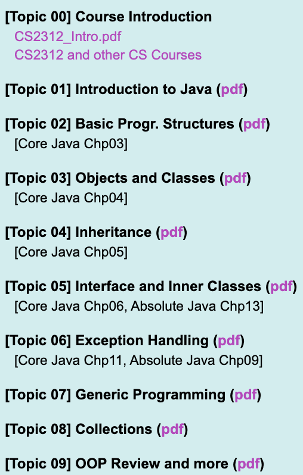

# CS2312 Problem Solving and Programming

Course Syllabus: [Click Here](https://www.cityu.edu.hk/catalogue/ug/201516/course/CS2312.pdf)

I will convert the Lab question to Markdown if I have time. If you want more resources (20-21 SEM A) about the lab question, Lecture or so on for your study, please feel free to contact me. I am glad to share with you.