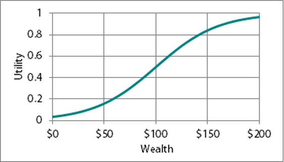
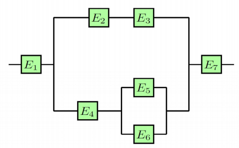

# CS2402 Midterm

## Q1

Suppose the rule in the unfinished game is that the pot goes to the player who first gets 4 points when playing a fair coin (in each round, they flip a coin and the winner gets one point). If the game stops when Alice has 3 points and Bob has 1 point, in what ratio, the pot should be divided between Alice and Bob?

## Q2 

What is the variance of the random variable X. Its corresponding probabilities are as follows.

| X | P(X) |
| -- | -- |
| 1 | 0.3 |
| 2 | 0.2 |
| 3 | 0.5 |

## Q3

```math
P(A\cup B)=0.7,P(A)=0.4,P(B)=0.5. P(AB)=?
```

## Q4
Suppose I have two hard-disks on my computer. I set the computer up so that the 2nd hard-disk has an exact copy of the 1st hard-disk. Assuming the failure rate of each hard-disk is 0.6%, and these two disks are independent of each other. Provide the following probabilities:

- I do not lose my data as at least one hard-disk works.
- Only one disk fails.

## Q5 

If you throw a dice twice, which is the probability that the sum of the two obtained numbers is strickly larger than 9.

## Q6

In 1980s, the NASA engineers estimated the probability of an accident in the first 25 Shuttle missions as 1/100. What is the probability of any accidents occurring in 25 missions?

(a) $1-(0.99)^{25}$

(b) $(1-0.99)^{25}$

(c) $(0.01)^{25}$

(d) $1-(0.01)^{25}$

(e) $(1-0.001)^{25}$

## Q7

There is a list of nonnegative numbers with an average of 100. At most how much percentage of these numbers are not smaller than 1000?

## Q8

In a game of Roulette, you decide to bet $100 on the number "6". If the ball lands on "6" the payout is 34 times your bet (you will win $3400). Otherwise, you will lose your bet. There are 38 numbers on the Roulette wheel, and each number has equal probability. What is your expected gain for this bet?

## Q9

Among families with 2 children, one of whom is a **girl** born at some time pm, what is the probability that the other child is a **boy**, and he was born at some time am? (we assume that there are two equal periods: am and pm)

## Q10

Let X and Y be independent, taking on {1,2,3,4,5} with equal probabilities. $E((X+Y)^2)=?$

## Q11

What is the behavior of a person with the following utility function?


(a) Risk-averse.

(b) Risk-seeking up to $100 wealth, then risk-averse after $100.

(c) Risk-seeking.

(d) Risk-averse up to $100 wealth, then risk-seeking after $100.

(e) Risk-neutral.

(f) Risk-averse up to $50 wealth, then risk-seeking after $50.

## Q12

Let A and B are two independent events with P(A)=0.5 and P (AB)=0.4.  P(B)=?

## Q13

Suppose that 3 fair 6-sided dice are rolled independently, each for once.  Compute the probability of getting 3 different numbers and the sum is no larger than 10.

## Q14

A deck of 52 randomly-shuffled playing cards. Randomly pick 2 cards. What is the probability that the two cards have the same rank (i.e., the same number)? [hint: in a deck of cards we have 13 different ranks]

## Q15

The school holds a sports competition. 20% of the students in your class are chosen for participating in ball games (event A), 10% of students are chosen for track and field (event B).  (a) If we know that the two events are independent, what fraction of students will participate in at least one of them? (b) If we know that the two events are mutually exclusive, what fraction of students will participate in at least one of them?

## Q16

Tom and Jerry play a rock-paper-scissors game (✊-✂️-🖐️). They play a total of 3 independent games, the one who wins at least twice is the winner. Compute the probability of Tom being the winner.

[If you are not familiar with the game, here is the rule: A player who decides to play rock will beat another player who has chosen scissors, but will lose to one who has played paper; a play of paper will lose to a play of scissors. If both players choose the same shape, the game is tied.]

## Q17

Let X and Y be the numbers obtained on two independent rolls of fair 3-sided dice. We can compute that the random variable X and Y have expectation 2 and variance $\frac{2}{3}$. $(E(X)=E(Y)=2)$ and $V(X)=V(Y)=\frac{2}{3}$. Let $Z=max(X , Y)$

(a) Compute the variance $V(X-2Y)$

(b) Compute the variance $V(X+Z)$

## Q18

If A and B are independent events of a random experiment such that $P(AB)=\frac{1}{6'}$ and $P(AB)=\frac{1}{3'}$, then compute $P(A)$.

## Q19

Tom firstly tosses a fair coin 3 times. If none of these 3 results is head, he will toss this coin once more. Then if he still doesn’t get one head result, he will try once more. (In this game, Tom tosses a coin at least three times and up to five times.) If the random variable X denotes the number of tosses, what is X's expected value?

## Q20

Roll one fair 6-sided dice, let X be the number observed.

(a) Find $E(X), Var(X), SD(X)$

(b) Let $Y$ be the sum of 10 independent rolls of fair dice. Find $E(Y), Var(Y), SD(Y)$.

(c) Calculate the following quantities: $E(X^2), E(3X+2), E((Y+2)^2), Var(-X), SD(2Y)$.

## Q21

The circuit operates only if there is a path of functional devices from left to right. The probability that each device functions is: $P(E_{1})=P(E_{7})=0.95, P(E_{2}) = P(E_{3}) = 0.9, P(E_{4}) = P(E_{5})=P(E_{6})=0.6$



## Solution

### Q1

Bob should win in the 3 following rounds to get the pot. Otherwise, he loses. So, the ratio for Bob is (1/2)3=1/8; for Alice is 7/8.

### Q2

Mean is $1\times 0.3 + 2\times 0.2 + 3\times 0.5 = 2.2$;

Variance is $(1-2.2)^2\times 0.3 + (2-2.2)^2\times 0.2+(3-2.2)^2\times 0.5 = 0.76$

### Q3

$P(AB)=P(A)+P(B)-P(A\cup B) = 0.2$

### Q4

- I do not lose my data as at least one hard-disk works. 
$1-(0.6\%\times0.6\%)=0.999964$

- Only one disk fails.
$2\times0.6\%\times(1-0.6\%)=0.011928$

### Q5
$(1/6)\times(1/6)+2\times(1/6)\times(1/6)+2\times(1/6)\times(1/6)+(1/6)\times(1/6)=1/6$

### Q6

A

### Q7

$100/1000=0.1$

### Q8

F

### Q9

2/7

### Q10

40

### Q11

B

### Q12

0.8

### Q13

the total number of possible events: $6^3$
consider all possible events (regardless of permutations) that satisfy the conditions: {1,2,3}, {1,2,4}, {1,2,5}, {1,2,6}, {1,3,4}, {1,3,5}, {1,3,6}, {1,4,5}, {2,3,4}, {2,3,5}. For each of them, there are $P_{3}^{3}$ permutations. Therefore, the probability is $10\times P_{3}^{3} / 6^3 = 5/18$

### Q14

total possible events = $C_{2}^{52}$; number of ways to pick two cards same rank: $C_{13}^{1}C_{4}^{2}$ The probability is $C_{13}^{1}C_{4}^{2}/C_{52}^2=1/17$

### Q15

(a) if two events are independent, $P(A\cap B)=P(A)P(B)=0.2\times0.1=0.02$ then $P(A\cup B)=P(A)+P(B)-P(A\cap B)=0.2+0.1-0.02=0.28$

(b) if two events are mutually exclusive, $P(A\cap B)= 0, P(A\cup B)=P(A)+P(B)=0.3$

### Q16

the probability that one win for each game is  $(1-3/3^2)/2=1/3$ In order to win, Tom will have to win in the first two games or win one of the first two games plus the last game. Each game is independent, so the probability that Tom wins in the first two games is $C_{2}^2(1/3)^2=1/9$ the probability that Tom wins one of the first two games plus the last game: $(C_{2}^1(1/3)^1(1/3)^1)\times 1/3 = 4/27$. The probability of Tom being the winner is the sum of the two, $1/9+4/27=7/27$

### Q17

(a) Since the random variables X and Y are independent, $V(X-2Y)= V(X)+V(2Y) = V(X)+4\times V(Y) = 10/3$

(b) Z can take 1,2,3, X+Z can take 2,3,4,5,6

$P(X+Z=2)=P(X=1,Z=1)=P(X=1,Y=1)=P(X=1)P(Y=1)=(1/3)\times (1/3)=1/9$

$P(X+Z=3)=P(X=1,Z=2)=P(X=1,Y=2)=(1/3)\times (1/3)=1/9$

$P(X+Z=4)=P(X=2,Z=2)+P(X=1,Z=3)=P(X=2,Y=1)+P(X=2,Y=2)+P(X=1,Y=3)=1/3$

$P(X+Z=5)=P(X=2,Z=3)=P(X=2,Y=3)=1/9$

$P(X+Z=6)=P(X=3,Z=3) = P(X=3,Y=1)+P(X=3,Y=2)+P(X=3,Y=3)=1/3$

$E(X+Z)= 2×P(X+Z=2)+3\times P(X+Z=3)+4\times P(X+Z=4)+5\times P(X+Z=5)+6\times P(X+Z=6)=40/9$

$V(X+Z)=1/9\times (2-40/9)^2+1/9\times(3-40/9)^2+1/3\times(4-40/9)^2+1/9\times(5-40/9)\times+1/3\times(6-40/9)^2=146/81$

### Q18

Since $P(AB)=P(A)P(B)=1/6$, $P(B)=1/6\times 1/P(A)$

Since $P(AB)=P(A)P(B)=(1-P(A)) (1-P(B)) = 1-P(A)-P(B)+P(A)P(B)=1-P(A\cup B)=1/3$,

We have $P(A\cup B)=1-1/3=2/3=P(A)+P(B)-P(AB)=P(A)+P(B)-P(A)P(B)$, $P(A)+1/6\times (1/P(A))-P(A)\times 1/6\times 1/P(A)=2/3$

Solve this equation, $A=1/3$ or $A=1/2$

### Q19
Since Tom will toss a coin 3 or 4 or 5 times, the space of the random variable X is

$R_{X}={3,4,5}$

```
P(X=3) = P(at least one head) = 1 - P(no heads in first 3 times) = 1 - (P(tail in each try))^3 = 1 - (1/2)^3 = 7/8
P(X=4) = P(3 tails and 1 head in last try) = (1/2)(1/2)^3  = 1/16
P(X=5) = P(4 tails and 1 head in last try) = P(5 tails in 5 tries) = (1/2)^5 +(1/2)(1/2)^4 = 1/16
Hence, the expected value of the random variable is 
E(X) = 3 P(X=3) + 4 P(X=4) + 5 P(X=5) = 3(7/8)+4(1/16)+5(1/16) = 51/16 
```

### Q20
(a) 

$E(X)=1(1/6)+2(1/6)+3(1/6)+4(1/6)+5(1/6)+6(1/6)=7/2$

$Var(X)=((1-7/2)^2(2-7/2)^2+(3-7/2)^2+(4-7/2)^2+(5-7/2)^2+(6-7/2)^2)\times (1/6)=25/12$

$SD(X)=\sqrt{Var(Y)}=\sqrt{35/12}$

(b)

$E(Y)=10\times E(X)=35$

$Var(Y) = 10\times Var(X)=175/6$

$SD(Y) = \sqrt{Var(Y)} = \sqrt{175/6}$

(c)

$Var(X) = E(X^2)-(E(X))^2$, so $E(X^{2})=35/12+(7/2)^2=91/6$

$E(3X+2) = 3\times E(X)+2=25/2$

$E((Y+2)^2)=E(Y^2)+4E(Y)+4=175/6+(35)^2+4\times 35+4=8389/6$

$Var(-X)=(-1)^2\times Var(X)=35/12$

$SD(2Y)=\sqrt{Var(2Y)}=\sqrt{2^2Var(Y)}=\sqrt{350/3}$

### Q21

The circuit work can be represented as $E_1\cap[(E_2\cap E_3)\cup(E_4\cap (E_5\cup E_6))]\cap E_7$

$P(E_2\cap E_3)=0.9\times 0.9=0.81$

$P(E_4\cap (E_5\cup E_6))=0.8\times (1-(1-0.8)\times (1-0.8))=0.768$

Therefore, P(function well) = $0.95\times (1-(1-0.81)\times (1-0.768))*0.95=0.8627$