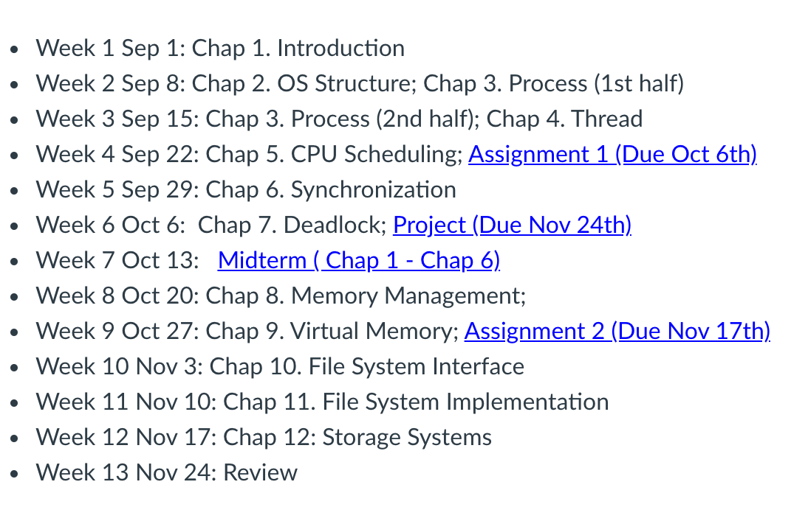

# CS3103 Operating System

Course Syllabus: [Click Here](https://www.cityu.edu.hk/catalogue/ug/201617/course/CS3103.pdf)

Textbook: [Click Here](http://pages.cs.wisc.edu/~remzi/OSTEP/#book-chapters)

If you want more resource (20-21 SEM A) such as mid-term, exam, lab or so on for your study, please feel free to contact me. I am glad to share with you.