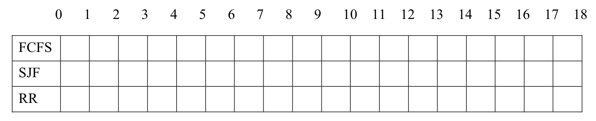
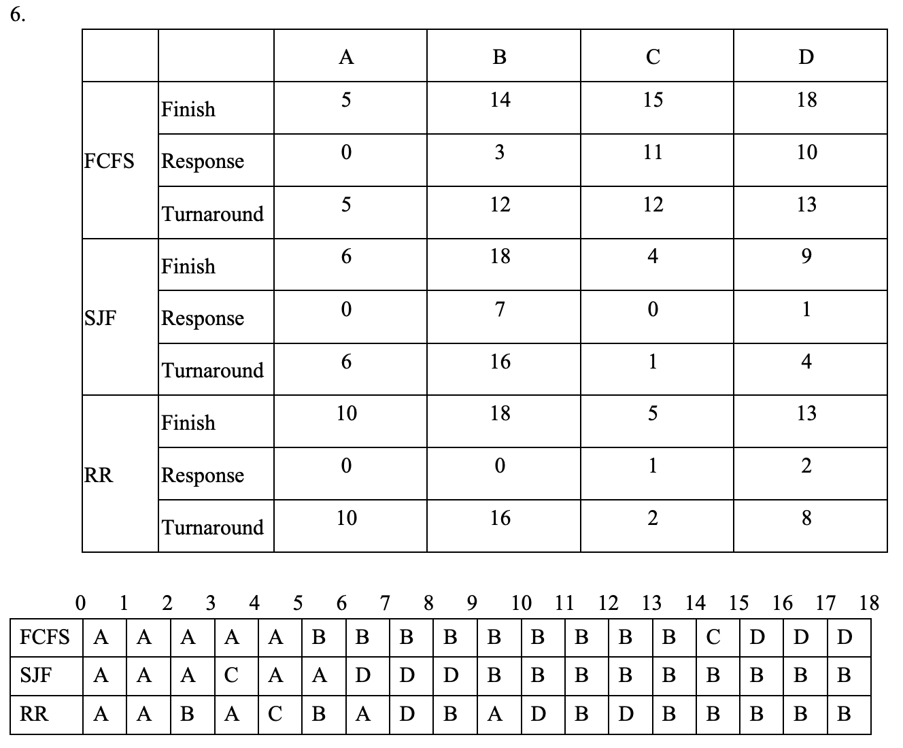

# CS3103 Assignment 1

## Part I General Questions
1. Describe how you could obtain a statistical profile of the amount of time spent by a program executing different sections of its code. Discuss the importance of obtaining such a statistical profile.

2. Describe the operating system's two modes of operation.
3. Describe the relationship between theAPI, the system-call interface, and the operating system.Why use APIs rather than system calls?
4. Whatare the differences between user-level threads and kernel-support threads? Name and describe the four different multithreading models.
5. What is the purpose of the command interpreter? Why is it usually separate from the kernel? Would it be possible for the user to develop a new command interpreter using the system-call interface provided by the operating system?
6. Consider the following process A, B, C, D with arrival and processing times as given in the table:

| Process Name | Arrival Time | Processing Time |
| -- | -- | -- |
| A | 0 | 5 |
| B | 2 | 9 |
| C | 3 | 1 |
| D | 5 | 3 |

Compute  the  finish  time,  response  time,  and  turnaround  time  for  each  process  for  the  following  CPUScheduling. Insert the values into the following table:

<table>
<tr>
    <td colspan='2'></td>
    <td>A</td>
    <td>B</td>
    <td>C</td>
    <td>D</td>
</tr>
<tr>
    <td rowspan='3'>FCFS</td>
    <td>Finish</td>
    <td></td>
    <td></td>
    <td></td>
    <td></td>
</tr>
<tr>
    <td>Reponse</td>
    <td></td>
    <td></td>
    <td></td>
    <td></td>
</tr>
<tr>
    <td>Turnaround</td>
    <td></td>
    <td></td>
    <td></td>
    <td></td>
</tr>
<tr>
    <td rowspan='3'>SJF</td>
    <td>Finish</td>
    <td></td>
    <td></td>
    <td></td>
    <td></td>
</tr>
<tr>
    <td>Reponse</td>
    <td></td>
    <td></td>
    <td></td>
    <td></td>
</tr>
<tr>
    <td>Turnaround</td>
    <td></td>
    <td></td>
    <td></td>
    <td></td>
</tr>
<tr>
    <td rowspan='3'>RR</td>
    <td>Finish</td>
    <td></td>
    <td></td>
    <td></td>
    <td></td>
</tr>
<tr>
    <td>Reponse</td>
    <td></td>
    <td></td>
    <td></td>
    <td></td>
</tr>
<tr>
    <td>Turnaround</td>
    <td></td>
    <td></td>
    <td></td>
    <td></td>
</tr>
</table>

Draw the schedule for each scheduling scheme by filling in the name of the current running process. Each square representsone time unit.




1. Discuss how the following pairs of scheduling criteria conflict in certain settings.
    1. CPU utilization and response time
    2. Average turnaround time and maximum waiting time

2. The following two questions are based on running the same x86.pysimulator provided in tutorial 3. Copy  the x86.pysimulator  and programwait-for-me.s, which arein /public/cs3103/assignment1/directory,toyour working directoryon gateway server.
   1. Run: ./x86.py -p wait-for-me.s -a ax=1,ax=0 -R ax -M 3000. This sets the %axregister to 1 for thread 0, and 0 for thread 1, and watches %axand memory location 3000. How should the codebehave? How is the value at location 3000 being used by the threads? What will its final value be?
   2. Now switch the inputs: ./x86.py -p wait-for-me.s -a ax=0,ax=1 -R ax -M 3000.How do the threads behave? What is thread 0 doing? How would changing the interrupt interval (e.g., -i 1000, or perhaps to use random intervals) change the trace outcome? Is the program efficiently using the CPU?

## Part II C Programming
### Problem Description

In  this programming  assignment,  you'll  build a  pair  ofLinuxutilities,  simple  versionsof  commonly  used commands zip/unzip. We'll call each of them a slightly different name to avoid confusion; for example, instead of zip, you'll be implementing czip(i.e., "cityu" zip).

The tools you will build come in a pair, because one (czip) is a file compression tool, and the other (cunzip) is a file decompression tool.The type of compression used here is a simple form of compression called run-length encoding (RLE). RLE is quite simple: when you encounter n characters of the same type in a row, the compression tool (czip) will turn that into the number n and a single instance of the character.

Thus, if we had a file with the following contents:
```
aaaaaaaaaabbbb
```

The tool would turn it (logically) int
```
10a4b
```

However, the exact format of the compressed file is quite important; here, you will write out a 4-byte integer in  binary  format  followed  by  the  single  character  in  ASCII.  Thus,  a  compressed  file  will  consist  of  some number  of  5-byte  entries,  each  of  which  is  comprised  of  a  4-byte  integer  (the  run  length)  and  the  single character

To write out an integer in binary format (not ASCII), you should use fwrite(). Read the man page for more details.  For czip,  all  output  should  be  written  to  standard  output  (the stdoutfile  stream,  which,  as  with stdin, is already open when the program starts running).

Note that typical usage of the czip tool would thus use shell redirection in order to write the compressed output to a file. For example, to compress the file file.txt into a (hopefully smaller) file.z, you would type:
```
./czip file.txt > file.z
```

The "./" before the czipabove is a UNIX/Linuxthing; it just tells the system which directory to find czipin (in this case, in the "." (dot) directory, which means the current working directory).The "greater than" sign is a UNIX/Linuxshell redirection; in this case, it ensures that the output from czip is written to the file file.z (instead of being printed to the screen). 

The cunzip tool simply does the reverse of the czip tool, taking in a compressed file and writing (to standard output again) the uncompressed results. For example, to see the contents of file.txt, you would type:
```
./cunzip file.z
```


## Submission


1. To obtain a statistical profile of the amount of time spent by a program executing could send the periodic of interrupts, then monitor the code which instructions or sections is running when the interrupts are occurred. In addition, the statistical profile of the time spent by the different sections of its code of program execution should be consistent. Also, if the developer obtaining such a statistical profile, it can optimize those sections of code to improve the effectiveness of using the CPU resource.

2. The Computer System to ensure the correctly execute the operating system. The Computer System will provide user mode and kernel mode mostly. When the user is executing the user Application, the system will in user mode. On the other handle, the user application are requests the operating system function or service through system call, it will change to kernel mode from user mode.

3. Most programming languages provide a system call interface and It acts as a link to the system calls provided by the operating system. Also, the API will intercept function calls as well as invokes necessary calls within the operating system. the System calls are detailed and more difficult to work with and using an API can expect the program can run on any system if support that API.

4. The user level treads, thread management done by user-level threads library. About the kernel- Level, thread management is done by the Kernel and operating system directly support. Regarding The multithreading model, first of all, it is Many to Many Model, which is Multiplex any number of user threads onto an equal or fewer number of kernel threads. Secondly, One-to-One model, each User-level thread maps to kernel thread. Thirdly, many to one model, Map many user-level threads to a kernel-level thread. Lastly, two-level model, Similar to M:M, except that it allows a user thread to be bound to kernel thread.

5. Command interpreters have many purposes; it has a large range command and read the user command and executes, often it will transfer the command into one or more system call. In addition, It may not part of the kernel, because the command parser have the opportunity to change. The user can create new command interpreter via system call interface. Besides, it allows user create , manage and determine communicate on the processes. Therefore, the user can utilize all of above function to develop the user-level program use the system call, it is possible for develop a new command-line interpreter.



7. If the CPU utilization increased, the context switching will be minimized the context switching is rarely performed. However, this may lead to increasing the processes response time. Besides, about the Average turnaround time and maximum waiting time, generally the SJF have minimized the average turnaround time, but that may starve long-running Tasks and thereby increase waiting time of their.

8. First of all, the thread 0 test the %ax whether equal to 1. Due to the condition is true so it will go To the signaller section and store the value to memory location 3000. After the thread 0 halts Change to the thread 1 and start run, test the %ax the conduction is not match jump to signaler section is not satisfied. The %cx store the 3000 memory location value, and test the %cx whether the conduction. Due to the conduction is true, it will go to the waiter section. The location 3000 use to check the value in location 2000 to see whether can run. The final value is 1.

9. First, check the thread 0 %ax whether equals to 1, due to thread 0 %ax set value is 0 initial so the Conduction is false. Then, store the value at location 3000 to %cv register and check if it is not equal to 1 will go back to top of. waiter section again. This case will hold until interrupted. In Thread 1, test the value of % ax it matches the conduction and store the value to 3000 memory Location and switch to thread 0. Due to the last “test” in the waiter section finds %cx is equal 1 so the program finally halts. 
Change the interrupt frequency to large number will increase the loop of thread 0 and waiting time In the thread 1. 
At the current interrupt rate is not using the CPU efficiently. The thread 0 is wastes CPU time.
