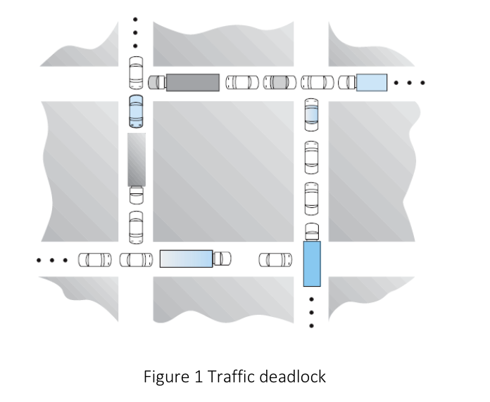
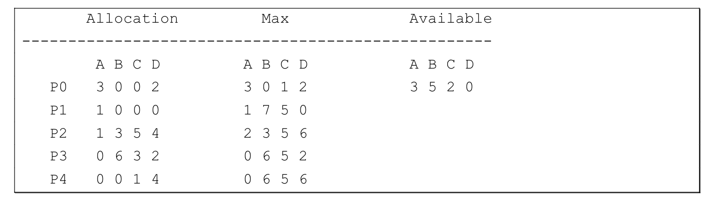

# CS3103 Assignment 2
1. Consider the traffic deadlock depicted in Figure
   1. Show that the four necessary conditions for deadlock indeed hold in this example.
   2. State a simple rule for avoiding deadlocks in this system.

2. Consider the following snapshot of a system:

    Answer the following questions using the Banker's algorith:
    1. How many resources of type A, B, C, and D are there? 
    2. the system in a safe state? Explain and show the detail steps
    3. if a request from process P1 arrives for additional resources of (0, 4, 2, 0), can the Banker algorithm grant the request immediately? Explain and show the detail steps.

3. Consider a paging system with the page table stored in memory.
   1. If a memory reference takes 280 nanoseconds, how long does a paged memory reference take?
   2. If we add TLB, and 80 percent of all page-table references are found in the TLB, while accessing TLB takes 10 nanoseconds. What is the effective memory reference time?

4. 
   1. Compare paging with segmentation with respect to the amount of memory required by the address translation structures in order to convert virtual addresses to physical addresses.
   2.  Why are segmentation and paging sometimes combined into one scheme?

5. Given the following reference string:
1, 2, 3, 4, 5, 3, 4, 1, 6, 7, 8, 7, 8,9, 7, 8, 9, 5, 4, 5, 4, 2, 
    Run (a) the Optimal page replacement algorithm, (b) the LRU page replacement algorithm on the above reference string with a 4 free frame physical memory and computing the number of page faults on that string, respectively.

