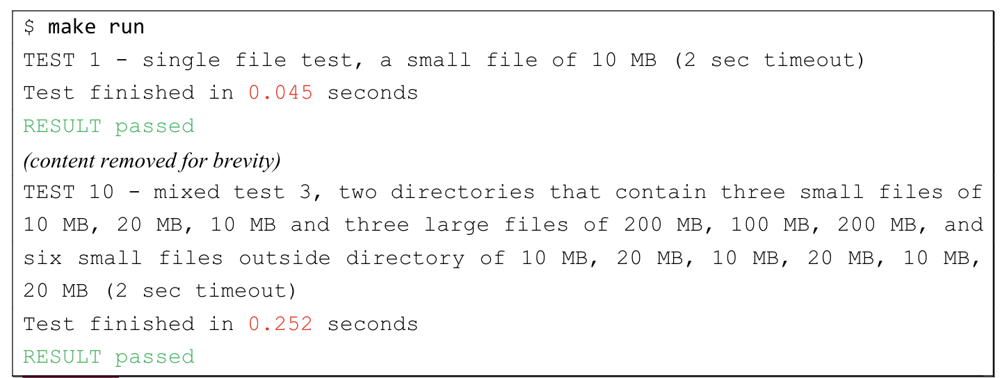
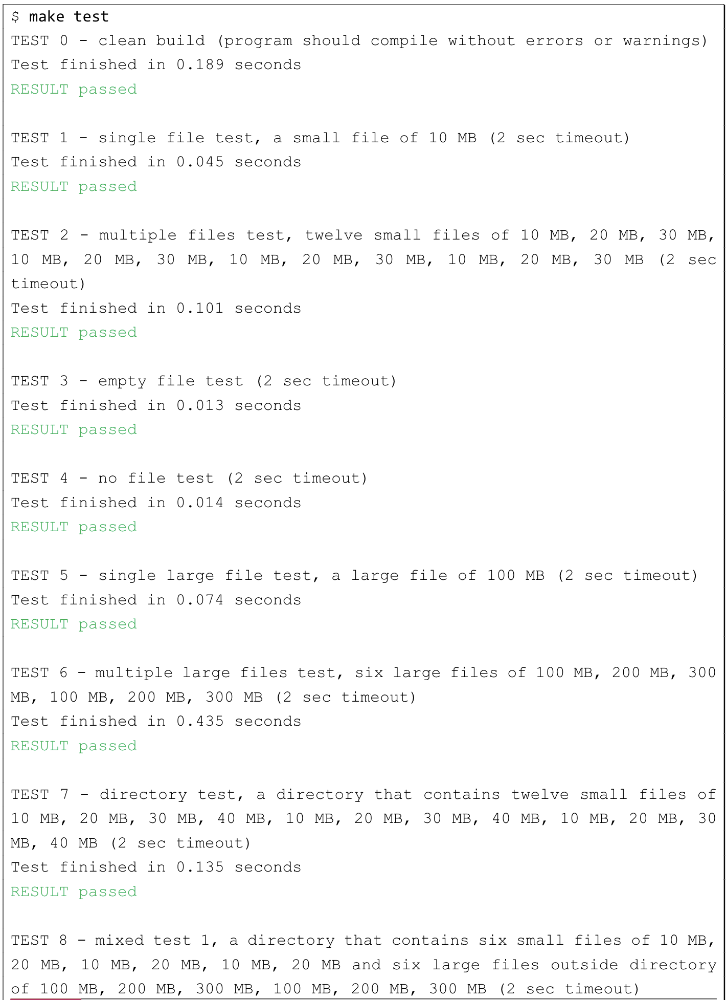

# CS3103 Operating Systems Project (Parallel Zip)

Version: 2.1 (Last updated on 21 Oct 2020)

The pzip.c is the file that you will be handing in and is the only file you should modify.

Read the project document carefully in order to prepare yourself for this project.

## Overview
In theearlier programming assignment, you implemented a simple compression tool based on run-length encoding, known simply as czip. For this project, you'll implement something similar, except you'll use threads to make a parallel version of czip. We'll call this version pzip.

There are three specific objectives to this project
1. To familiarize yourself with the Linux pthreads libraryfor writingmulti-threaded programs.
2. To learn how to parallelize a program.
3. To learn how to program for performance.

## Project Description
For this project, you will implement a parallel version of zipusing threads. First, recall how zip works by reading the description in Assignment 1 Part II. You'll use the same basic specification, with run-length encoding(RLE)as the basic technique.

RLE is quite simple: when you encounter n characters of the same type in a row, the compression tool (pzip) will turn that into the number n and a single instance of the character.

Thus, if we had a file with the following contents:
```
aaaaaaaaaabbbb
```

The tool would turn it (logically) into:
```
10a4b
```

However, the exact format of the compressed file is quite important; here, you will write out a 4-byte integerin binary format followed by the single character in ASCII. Thus, a compressed file will consist of some number of 5-byte entries, each of which is comprised of a 4-byte integer (the run length) and the single character. To write out an integer in binary format (not ASCII), you should use fwrite(). Read the man page for more details. For pzip, all output should be written to standard output (the stdoutfile stream).

Your pzipwill externally look the sameas czip. However, internally, the program will use POSIX threads to parallelize the compression process.The general usage from the command line will be as follows:
```
/pzip file.txt > file.z
```

Doing so effectively and with high performance will require you to address (at least) the following issues:

1. How  to  parallelize  the  compression.The  central  challenge  of  this  project  is  to  parallelize  the compression process. You are required to think about whether the compression process can be separated into several sub-processes, what sub-processes can be done in parallel, and what sub-processes must be done serially by a single thread.Then, you are required to design your parallel zip as appropriate.For example, does it possible to zip several small sub-files using multiple threads instead of zipping a large file using only one thread? If it's possible, how to divide the large file? How to zip those small sub-files using multiple threads? How to mergezippedresultsof several small sub-files? One interesting issue that the "best" implementations will handle is this: what happens if one thread runs much slowerthan another? Does the compression give more work to faster threads? This issue is often referred to as thestraggler problem.
2. How to determine the number of threads to create.On Linux, the determinationof the number of threadsmay refer to some interfaces likeget_nprocs()andget_nprocs_conf(); You are suggested to read the man pages for more details. Then,you are required tocreate an appropriate number of threads to match the number of CPUs available on whichever system your program is running.
3. How to efficiently compress multiple files in parallel.In previous issues, you may have completedthe parallel compression  for  one  large  file.Now  you  are  required  to  think  about  how  to  parallelize  the compressionprocesses of multiple files. A naïve way is to sequentially process the parallel compression process  of  each  file.However, thismethod  cannot fully explore  the  parallelism  of  the  compression processesof multiple files.You are required to explore the parallelism between the compression processes of multiple filesand design an efficient and fastparallel method to compress multiple files.Note that when the input containsdirectories, you canfirst obtain the paths of all files in the directories recursivelyusing readdir(), then compress them as multiple files.
4. How to access the input file efficiently.On Linux, there are many ways to read from a file, including C standard library calls likefread()and raw system calls likeread(). One particularly efficient way is to use memory-mapped files, available viammap(). By mapping the input file into the address space, you can then access bytes of the input file via pointers and do so quite efficie

To understand how to make tackle these problems, you should first understand the basics of thread creation, and perhaps locking and signaling via mutexlocks and condition variables. Review the tutorials and read the followingchapters from OSTEP book carefully in order to prepare yourself for this project

1. Intro to Threads
2. Threads API
3. Locks
4. Using Locks
5. Condition Variables

### Project Guidelines
The project is to be done on the CSLab SSH gateway server, to which you should already be able to log in.As before, follow the same copyprocedure as you did in the previous tutorialsto get the project files (code and test files). They are available in/public/cs3103/project/on the gateway server.project.zip contains the following files/directories:

```

```

Start by copying the provided files to a directory in which you plan to do your work.For example, copy /public/cs3103/project/project.zipto your home directory, extract the files from the ZIP file with the unzipcommand. Note that the file size of project.zip is only 10MB, but the uncompressed project directory has a size of 5GB. Ittakes about 90secondsto unzip the project.zip fileon our gateway server. Afterthe unzip command extracts all files to the current directory, change to the project directoryand take a look at the directory contents:

```
cd ~
cp/public/cs3103/project/project.zip .
unzip project.zip
cd project
ls
```

A sample pzipis also provided(we only provide a single executablefile without source code).Thispzipuses pthreadto support the parallel compression of multiple files or directories. When the input files of the compression  process  contain  directories,  the pzipfirst  obtains  the  paths  of  all  files  in  the  directories recursivelyusing readdir(), then treats the compression process as the compression of multiple files. For the multiple files’compression, the pzipuses mmapto map files into multiple pages and compress all pages in parallel. The parallel compression process can be treated as producer-consumer problem. The pzipuses one thread of producer to map files and multiple threads of consumers to compress pag

You can run and test pzipby using the *make run* command.


You can also use this one as a baseline implementation for performance evaluation, which means you can compare the execution time of your pzipwith that of the provided one in final report. Note that after building your own pzip(using makeor maketest), the provided pzipfile will be overwritten. But don’t worry, you can always copy it from /public/cs3103/project/pzip.

#### Writing your pzip program
The pzip.c isthe file that youwill be handing in and isthe only file you should modify.Write yourcode from scratch or simply borrowthe codefrom your czipto implement this parallel version of zip. Again, it's a good chanceto learn (as a side effect) how to use a proper code editor such as vim.

#### Building your program
A simple makefile that describes how to compile pzipis providedfor you.

To compile your pzip.c and to generate the executable file, use the makecommand within the directory that contains your project.It will display the commandused to compilethe pzip.

```
$ make
gcc -Wall -Werror -pthread -O pzip.c -o pzip
```

Note that the -Werrorcompilerflag is specified.It causes all warnings to be treated as build errors.Itwould be better to fix the compiling issue instead of disabling -Werror flag.

If everything goes well, there would anexecutable file pzip in it:
```
$ ls
Makefile  pzippzip.c  README.txt  tests
```

If you make some changesin pzip.clater, you should re-compile the project by running *make* command again.
To remove any files generated by the last make, use the *make clean* command.

```
$ make clean
rm -f pzip
$ ls 
Makefile  pzip.c  README.txt  tests
```

#### Testing your C program
We also provide 10test cases for you to test your code. You canfind them in the directory tests/tests-pzip/.Themakefile could also trigger automated testing scripts, typemake run(run testing only) or make test (build your program and run testing).



The job of those automated scripts is to orderly run your pzipon the test cases andcheck if your pzipzips input files correctly. TEST 0 (available for make test) will fail if your program iscompiledwitherrors or warnings.Time limitation is set for each test case, and if this limit is exceeded,your test will fail.Besides, the script  will  record  the  running  time  of  your  programfor  performanceevaluation. Shortertime/higher performance will lead to better scores.

Below is a brief description of eachtest case:

Test case 1-6: Test cases 1, 2, are small files. For test case 3, the file is empty. For test case 4, there is no file. if no files are specified, the program should exit with return code 1 and print "pzip: file1 [file2 ...]" (followed by a newline).

Test case 7-10: Some files are stored in a directory, and you are required to compress the directory and other files. Do note that if multiple files are passed to pzip, they are compressed into a single compressed output. The information that multiple files were originally input into pzipis lost.

```
Test case 1)    single filetest –a small file.
Test case 2)    multiple files test –twelve small files of different file size.
Test case 3)    empty file test.
Test case 4)    no files test.
Test case 5)    single large file test –a large file.
Test case 6)    multiple large files test –six large files of different file size.
Test case 7)    directory test –a directory that contains twelve small files of different file size.
Test case 8)    mixed test 1 –a directory that contains six small files, and six large files outside directory.
Test case 9)    mixed test 2 –a directory that contains six large files, and six small files outside directory.
Test case 10)   mixed test 3 –two directories that contain three large files and three small files, and six small files outside directory.
```