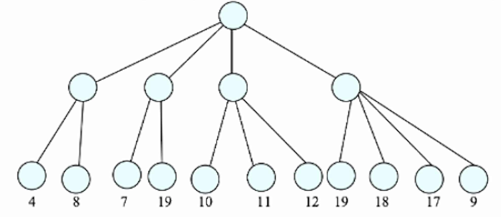
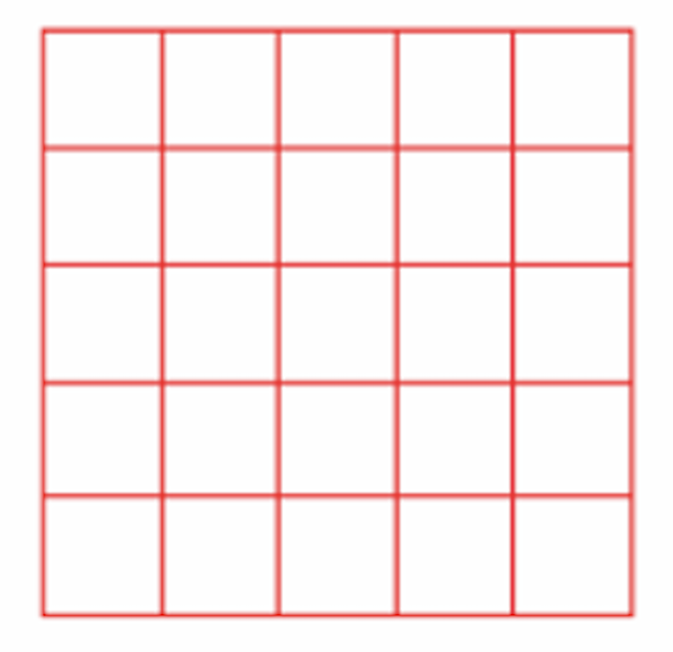
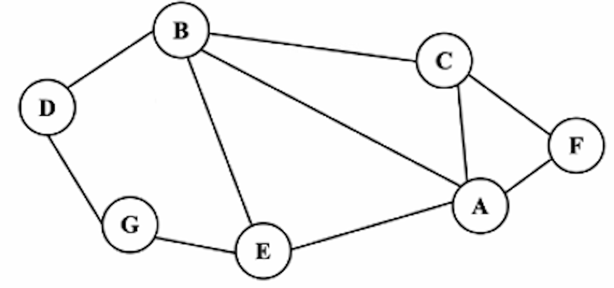

# CS3334 Exam
## Part A
### Question 1 (15pt)
Explain whether the following statements are correct or not:

i) The running time of Radix sort, Merge sort are both O(nlogn).

ii) In order to delete one node in a doubly linked list, we need to do four link changes in total.

iii) The DFS sequence and BFS sequence can be the same for some graphs.

iv)In a binary search tree. the largest key can onlv be stored in a leaf node.

v) Sola tree also has a worst case guarantee of Odogn) time for each insertion like AVL tree.

### Question 2 (5pt)
Do Big-Oh Analysis for the following function:
```math
T(n)=(\log n)^{50}+1000n^{0.01}
```

### Question 3 (10pt)
Given the following traversal sequences, reconstruct the corresponding binary tree, if possible:
1. Preorder sequence: ABDEGCF;
Inorder sequence: DBGEACF
2. Postorder [9,15,7,20,3];
Inorder[9,20,3,15,7]

### Question 4 (5pt)
You are given the following game tree where player 1 takes the first move and the total amount of 100 dollars will be divided between player 1 and player 2 after the game ends. The value specified for a certain leaf is the amount of dollars player 1 can get if the game process follows the path from root to that leaf. Please decide the best move for player 1 as the first step using the minimax rule. Does this tree allow you to cut some branches using@-Bpruning if you search the children from left to right?



### Question 5 (8pt)
Explain the process of radix sort when the following numbers are the input: 19, 34, 224, 73, 98, 117, 546, 12, 102, 142, show the steps.

### Question 6 (12pt)
A6. When we are using Stack to generate a maze, suppose we are dealing with 5*5=25 rooms. The upper left corner is the ENTRANCE, and the lower right corner is the EXIT. The algorithm will not stop until every room is visited in Question (a) and Question (b).

(a) AT MOST how many walls can be broken and AT LEAST how many walls can be broken during the whole maze generation process?

(b) AT MOST how many rooms can be on the path from the entrance to the exit and AT LEAST how many rooms?

(c) Answer the above two questions when we are using Disioint Set to generate the maze. and we stop the process if the entrance can be connected to the lower right corner



### Question 7 (10pt)

i) Give the adjacency matrix representation for the following graph. (Follow the order of alphabet.)

ii) Do DFS and BFS (starting from node D) on the following graph.



### Question 8

a) Do heap sort on the following numbers: 3, 1, 4, 5, 7, 6, 2, 9. Show how the whole array changes step by step.

b) Someone wrote the pseudocode of a 3-way merge sort as follows.
```
Mergesort() {
    Mergesort (a, i, i+(j-i)/2):
    Mergesort (a, i+(j-i)/2, i+3(j-i)/4);
    Mergesort (a, i+3(j-i)/4, j);
    Merge(a,i,j);
}
```

Here Merge(a,i,j) is the function merging three sorted subarrays into one whole array taking time $j-i$.

We use T(n) to represent the time needed to run Mergesort() for i=1 and j=n. Write the recursive relation for T(n) and derive the Big-O for it (Show the proof steps)

### Question 9 (5pt)

Given a sequence 3, 6, 1, 5, 8, 7, 2 which is to be inserted into an emotv AVL tree. Show step by step how the AVL tree changes.

## Part B
### Question 10 (10pt)
Rotate Singly-linked List.

Given a singly-linked list and an integer $k$. Define an operation named "Rotation", which means moving the tail of the list to the head position. For example, Linked List: [2] -> [4] -> [5] -> [1]. K=1 After "Rotation" for K times, we will have **[1]** -> [2] -> [4] -> [5].

If we change the K from 1 to 3. The linked list would become: **[4]** -> **[5]** -> **[1]** -> [2]

The definition of List Node in C++ is as follows:

```c++
struct ListNode {
    int val;
    ListNode *next;
    ListNode(): val(0),next(nullptr){}
    ListNode(int x): val(x),next(nullptr){}
    LIstNode(int x, ListNode* next): val(x), next(next){}
};
```

(a) Please complete the following function of "Rotation". It's okay to write pseudo code, but the pointers operation should be absolutelv correct. (Pointer operation is the core of linked lists.)

The return value and parameters are provided. (The function should return the head pointer after rotation.) **Boundary conditions need to be considered and shown in your code.**

Ans: 
```c++
ListNode * rotate(ListNode* head, int k){
    //Please write your code here
}
```

(b) What is the timing complexity in the last question? Is this the best complexity? If not, how to achieve the best complexity?

### Question 11 (10pt)

Design the binary tree clas (not binary search tree), and write a member function **int Tree::AverageSuperInternal()** which returns the average value stored in all the internal nodes (which has at least two leat nodes as descendants) of the binary tree. You should use the recursive method to write your program and can write other unctions to help you to implement **int Tree::AverageSuperInternal()**.

### Question 12 (10pt)

(a) Prove that AVL tree has height $O(\log n)$ if the total number of nodes is $n$.

(b) Given two **sorted** (Assume both from smallest to largest) arrays with length $m$ and $n$, please find the median number of the array merged by these two arrays. The time complexity is limited: $O(\log{(m+n)})$. Pseudo code is accepted.

Example:
Given two arrays, Example a and Example b, with length 5 and 4:

Example a = [2,3,4,5,7]

Example b = [4,6,8,10]

The median of Example a is "4". (The number exactly in the middle position.)

The median of Example b is $(6+8)/2=7$. (There are two numbers in the middle, so we take their average as median.)

**The median after they merged: 5.**

Note: The size of Array a is m, the other's is n. Students can use these two numbers directly without definition. Boundary check check is NOT required in this question. Please focus on the algorithm itself.

```c++
double returnMedian(int[] Array_a, int[] Array_b){
    // Please write your answer here.
}
```