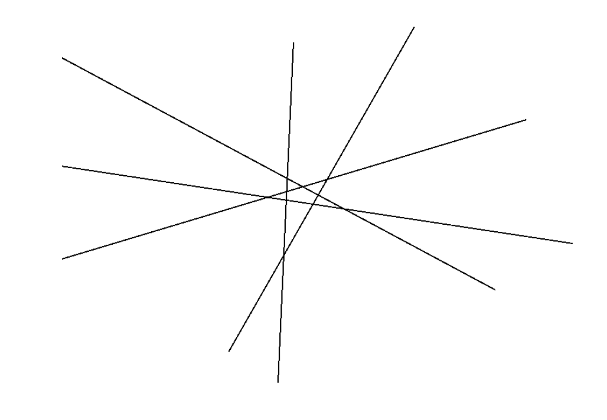
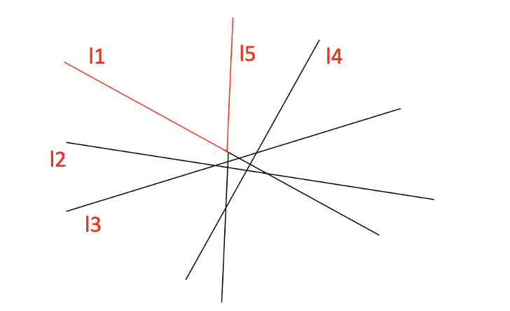
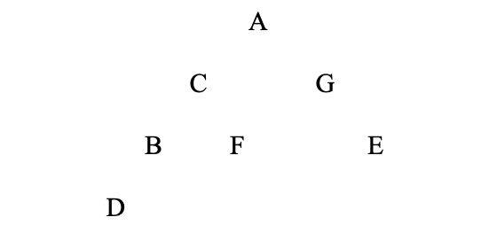

# CS3334 Mid-Term Question Part

## Question 1 
(10pt) Do Big-Oh Analysis for the following functions:

1. $T(n)=3^{n}+1000n^{999}+10$
2. $T(n)=100\log n+n+10$

## Question 2
(10pt) Analyze the running time of the following program:
```c
void function(int n){
    int x = 200;
    int y = 100;
    for(int i =0; i<n; i++){
        if(x>50)x--;
        else{
            for(j=0;j<n;j++) y++;
            x++;
        }
    }
}
```

## Question 3

(20pt) Is the following statement true or false? (If false, give the correct statement)
1. Given any input from an array, we can reconstruct a unique binary tree following the number labeling method (from top to down, left to right)
2. The worst case of “Check whether a word exists in a text file using linear search from the beginning to the end” is “The file is extremely big”.
3. As long as the hash table is at least half empty, using quadratic probing can always find an empty slot for any key
4. In a maze generated by Stack, there can be some rooms that are not reachable from the entrance.

## Question 4
(10pt) In a doubly linked list, write a program to switch two adjacent nodes pointed by p and q. (“adjacent” means p-RNext==q, q->LNext==p and we assume that these two nodes are in the middle of the doubly linked list).

The class definition is as follows:
```c++
class DoublyLinkedList {
    private:
        int data;
        ListNode* LNext; // a pointer which points to the left neighbor
        ListNode* RNext; //a pointer which points to the right neighbor
    public:
        Swap(ListNode*, ListNode*);
}
```

## Question 5
1. (10pt) Insert the following numbers into a hash table of size 7 using double hashing: 9, 47,37,72,18,149, 62. The two hash functions needed in double hashing are defined as follows. The hash function h1(x)=x%7 is used to decide the first trying slot. The hash fuction h2(x)=6- x%6 serves as the offset.
2. Explain why we cannot let h2(x)=x%6.

## Question 6
(10pt) In the lecture, we use an algorithm to generate line segments that can be seen from above. If the input lines are shown as below, then how many pushes and pops will be done throughout the whole process?


## Question 7
(10pt)
1. Show the steps for inserting 3,1,4,6,9,2,5,7,10 into an initially empty binary search tree. 
2. Show the result of inorder traversal for this binary search tree.

## Question 8
(10pt) Given the following traversal sequences, reconstruct the corresponding binary tree:
1. Postorder sequence: DBFCEGA
2. Inorder sequence: DBCFAGE

### Solution
#### Q1
1. $O(3^{n})$
2. $O(n)$

#### Q2

$T(n)=n, n < 150;$

$T(n)=n+((n-150)/2+1)\times n,n>=150$

#### Q3
1. True
2. False
3. False
4. True


#### Q4
```c++
void DoublyLinkedList::Swap(ListNode* p, ListNode* q) 
{
	p->Rnext = q->Rnext;
	q->Lnext = p->Lnext;
	p->Lnext->Rnext = q;
	q->Rnext->Lnext = p;

	p->Lnext = q;
	q->Rnext = p
}
```

#### Q5
1. 
```
	9: 	h1(9)=9%7=2	√
	47:	h1(47)=47%7=5	√
	37:	h1(37)=37%7=2	×	(h1(37)+h2(37))%7=(2+5)%7=0 √
	72：	h1(72)=72%7=2	×	(h1(72)+h2(72))%7=(2+6)%7=1 √
	18：	h1(18)=18%7=4	√
	149：	h1(149)=149%7=2 ×	(h1(149)+h2(149))%7=(2+1)%7=3 √
	62：	h1(62)=62%7=6 √

```

2. The value of h2(x) cannot be 0.

#### Q6


```
Processing: l1
Push(l1)
Processing: l2
Push(l2)
Processing: l3
Pop()
Pop()
(l2 deleted)
Push(l1)
Push(l3)
Processing: l4
Pop()
Pop()
Push(l1)
Push(l3)
Push(l4)
Processing l5
Pop()
Pop()
(l4 deleted)
Pop()
(l3 deleted)
Push(l1)
Push(l5)

Push 9, Pop 7

```

#### Q7

1. 
```
3 (NULL, NULL)

3 (1, NULL)
1 (NULL, NULL)

3 (1, 4)
1 (NULL, NULL)
4 (NULL, NULL)

3 (1, 4)
1 (NULL, NULL)
4 (NULL, 6)
6 (NULL, NULL)

3 (1, 4)
1 (NULL, NULL)
4 (NULL, 6)
6 (NULL, 9)
9 (NULL, NULL)

3 (1, 4)
1 (NULL, NULL)
4 (NULL, 6)
2 (NULL, NULL)
6 (5, 9)
9 (NULL, NULL)
5 (NULL, NULL)

3 (1, 4)
1 (NULL, 2)
4 (NULL, 6)
2 (NULL, NULL)
6 (5, 9)
9 (NULL, NULL)
5 (NULL, NULL)

3 (1, 4)
1 (NULL, 2)
4 (NULL, 6)
2 (NULL, NULL)
6 (5, 9)
9 (7, NULL)
5 (NULL, NULL)
7 (NULL, NULL)

3 (1, 4)
1 (NULL, 2)
4 (NULL, 6)
2 (NULL, NULL)
6 (5, 9)
9 (7, 10)
5 (NULL, NULL)
7 (NULL, NULL)
10 (NULL, NULL)
```
2. 1 2 3 4 5 6 7 9 10

#### Q8

```
A (C, G) 
C (B, F)
G (NULL, E)
B (D, NULL)
D (NULL, NULL)
F (NULL, NULL)
E (NULL, NULL)
```