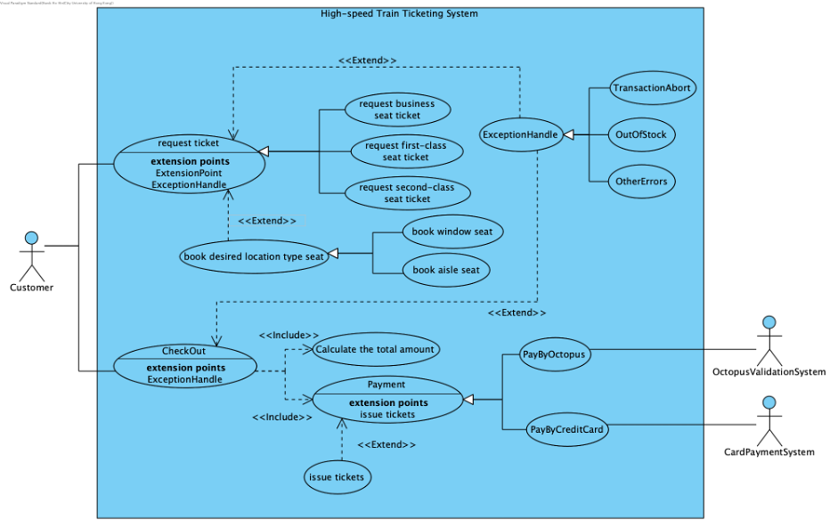
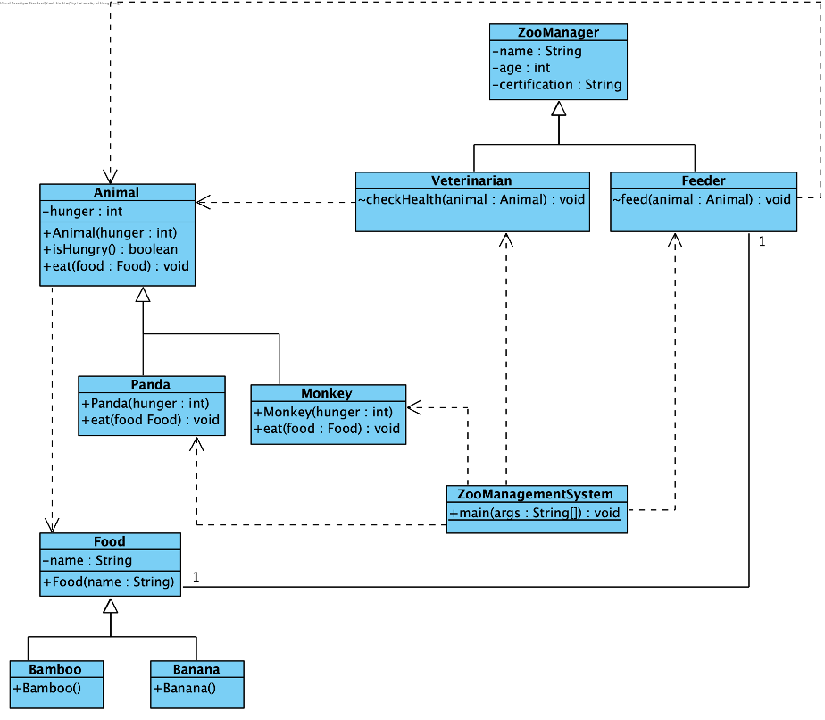

# CS3342 Assignment

## Section 1: Software Engineering – CILO1, 4 (20 Marks)

### Software Engineering Research study – CILO1 (10 Marks):

Please carry out an independent study according to your book readings and online research, to address **one** of the two questions below by writing a short essay. (500 words approx.)

1. What is software design and how it is important? Please discuss your answer with a case study (Please provide your references.)
2. What are the four important attributes that all professional software should have? Suggest four other attributes that may sometimes be significant. (Please provide your references.)

### Roles of Variables – CILO4 (10 Marks)
Study the following Java codes and identify the role of each variable declared in the code listing by completing the tables below (you may refer to the roles of variables lecture ppt):
```java
public class AddOneDArrays { 
    // Adding two 1-d arrays 
    public static void main(String[] args) { 
        int first_array[] = { 3, 4, 4, 3, 1, 6, 4, 3, 1, 2 };
        int second_array[] = { 2, 3, 5, 6 , 8, 3, 2, 5, 3, 6 }; 
        final int m = first_array.length; 
        final int n = second_array.length; 
        // first array contents 
        System.out.print("First array elements are:\t"); 
        for(int i = 0; i < m; i++){ 
            System.out.print(first_array[i] + " "); 
        } 
        
        // second array contents 
        System.out.print("\n\nSecond array elements are:\t");
        for(int i = 0; i < n; i++){ 
            System.out.print(second_array[i] + " "); 
        } 
        
        // creating a sum[] array to save the addition of two arrays 
        int sum[] = new int[10]; 
        final int l = sum.length; 
        for(int i = 0; i < l; i++) { 
            sum[i] = first_array[i] + second_array[i]; 
        } 
        
        // iterating array to print each element 
        int k; 
        double total = 0; 
        double avg = 0; 
        System.out.print("\n\nThe sum of two arrays is:\t"); 
        for (int i = 0; i < sum.length; i++) {
            k = sum[i]; total = total + k; 
            System.out.print(k + " "); 
        } 
        avg = total / m; 
        System.out.println("\n\nThe size of the sum array is:\t" + m); 
        System.out.println("Average of sum array is:\t" + avg); 
    } 
}
```

| Variable | Role | Marks |
| -- | -- | -- |
first_array |  | (1 Mark) |
second_array |  | (1 Mark) |
sum |  | (1 Mark) |
k |  | (1 Mark) |
i |  | (1 Mark) |
m |  | (1 Mark) |
n |  | (1 Mark) |
total |  | (1 Mark) |
avg |  | (1 Mark) |
l |  | (1 Mark) |

## Section 2: Software Requirements Analysis – CILO2 (20 Marks)

**Case study: High-speed Train Ticketing System**

When an Adult Customer wants to buy a high-speed train ticket through online booking system, the conduct ticket booking use-case/function usually includes two use-cases/functions: the consumer will request the desired type of tickets and payout those tickets.

For the request ticket use-case, the consumer should specify the price type (for example, business seat, first-class seat or second-class seat). What’s more, IF the customer requests specific location type (for example, window seat or aisle seat), THEN the system should then book the desired location type seat.

After all the selections are completed (Note that the customer can choose multiple tickets), he/she may proceed to the CheckOut use-case, which will include (1) Calculate the total amount, and then (2) proceed to the Payment screen, where he/she will be given two options: (hint: use-case inheritance):

1. **PayByOctopus**, the inserted cash will be validated by a **OctopusValidationSystem**
2. **PayByCreditCard**, the inserted credit card will be processed by a **CardPaymentSystem**

In both two use-cases, IF any error occurs, THEN the system must be able to handle it via **ExceptionHandling**, there are three different error exceptions (hint: use-case inheritance):

1. **TransactionAbort** (i.e. the customer chooses to cancel without completing the transaction)
2. **OutOfStock** (i.e. the booking system runs out of Tickets)
3. **OtherErrors** (i.e. this is to handle any other error not covered above)

IF the payment is successfully completed, THEN it will **issue the purchased tickets**. The customer can now pick up the ticket(s) purchased.

### Draw a complete use case diagram (10 Marks)
Based on the above, draw a use case diagram for Ticketing System. Whenever possible, your use case diagram MUST use **<\<Extend\>>** or **<\<Include\>>** to provide a good use case diagram.
\<Screen Capture: Place Use Case Diagram Here\>

### Requirements Specifications (10 Marks)
Based on the same case study described above, <u>complete the following table from step 3</u> to describe the **Request ticket** use case under <u>typical course of events</u>, and <u>alternative course of events</u>. The situation involves the **Customer** actor. Note that you should consider “OutOfStock” and “TransactionAbort” exception at the **Alternative course of events**.

| Use Case Name: | Request ticket |
| -- | -- |
| Actor(s): | Consumer|
| Description: | This use case describes the process of a customer request the desired ticket type to the system |
| Reference ID: | HK-TICKETING-1.0 |
| Typical course of events: | |
| Alternative course of events: | |

## Section 3: OO Modeling and Design Principles – CILO3 (20 Marks)

**<u>Case Study: Zoo Management System</u>**

The following is a simple implementation of zoo management system.

In the zoo, **Feeders** and **Veterinarians** take care of the **Animals** as **ZooManagers**. **Panda** and **Monkey** are two typical animals in this zoo. Their hunger abated after they eat the food. Within the code below, the following containing a **design issue** which disallows the feeder to choose different food according to different animal (e.g. **Banana** for **Monkey**, **Bamboo** for **Panda**).

Your first task is to study the following pseudo-code and analyze the design issue.

```java
class ZooManager { 
    private String name; 
    private int age; 
    private String certification; 
}

class Veterinarian extends ZooManager { 
    void checkHealth(Animal animal){ 
        // check animal’s health 
    } 
}

class Feeder extends ZooManager {
    void feed(Animal animal) {
        if (animal.isHungry()) {
            Food food = new Food("food");
            animal.eat(food);
        }
    }
}


class Animal {

    private int hunger;

    public Animal(int hunger) {
        this.hunger = hunger;
    }

    public boolean isHungry() {

        if (hunger > 0)
            return true;
        else
            return false;

    }

    public void eat(Food food){
        System.out.println("Eat"+" "+ food.name);
    }
}

class Panda extends Animal {
    public Panda(int hunger) {
        super(hunger);
    }

    public void eat(Food food) {
        System.out.println("Eat" + " " + food.name);
        // Hunger decrease 10 after eating food.
        super.hunger -= 10;
    }
}

class Monkey extends Animal {
    public Monkey(int hunger) {
        super(hunger);
    }

    public void eat(Food food) {
        System.out.println("Eat" + " " + food.name);
        // Hunger decrease 5 after eating food.
        super.hunger -= 5;
    }
}


class Food {

    private String name;

    public Food(String name) {
        this.name = name;
    }

}

class Banana extends Food {
    public Banana() {
        super("banana");
    }
}

class Bamboo extends Food {
    public Bamboo() {
        super("bamboo");
    }
}
```

```java
class ZooManagementSystem {

    public static void main(String[] args) {
        // Creation of animals and zoo managers.
        Monkey monkey = new Monkey(100);
        Panda panda = new Panda(50);
        Feeder feeder = new Feeder();
        Veterinarian veterinarian = new Veterinarian();

        // Health check for animals.
        veterinarian.checkHealth(monkey);
        veterinarian.checkHealth(panda);

        // Feed animals.
        feeder.feed(monkey);
        System.out.println(monkey.hunger);
        feeder.feed(panda);
        System.out.println(panda.hunger);
    }

}
```

#### Draw class diagram (10 Marks)
Based on your understanding of the code segment above, draw a complete class diagram to illustrate the class interactions and inheritance (NOTE: Class diagram captured from BlueJ will **NOT** be accepted, please use Visual Paradigm).

#### Fix design issues (10 Marks)
The above codes contain issues, which disallow the feeder to adjust appropriate Food such as **Banana** or **Bamboo**. In compliance with OCP design principle, please indicate where and how to modify the above code, so that **ZooManagementSystem** allows the change of different Foods, such as **Banana** or **Bamboo**. Explain your solution if necessary.


## Submission

## Section 1: Software Engineering – CILO1, 4 (20 Marks)

#### Software Engineering Research study – CILO1 (10 Marks)
```
Ref:

Tsang, Curtis H.K., Lau, Clarence S.W., & Leung, Y.K. (2010). Object-Oriented Technology: from Diagram to Code With Visual Paradigm for UML (2nd ed.). McGraw Hill. 

Booch, G., Rumbaugh, J., & Jacobson, I. (2005). Unified Modeling Language User Guide (2nd ed.). Addison-Wesley.

Case Study 8: Software Design, Development & Maintenance. (n.d.). Retrieved from Peridot Solutions: https://peridotsolutions.com/case-study-8-software-design-development-maintenance/
```


#### Roles of Variables – CILO4 (10 Marks)

| Variable | Role | Marks |
| -- | -- | -- |
first_array | Organizer | (1 Mark) |
second_array | Organizer | (1 Mark) |
sum | Transformation | (1 Mark) |
k | Temporary | (1 Mark) |
i | Stepper | (1 Mark) |
m | Constant | (1 Mark) |
n | Constant | (1 Mark) |
total | Gatherer | (1 Mark) |
avg | Transformation | (1 Mark) |
l | Constant | (1 Mark) |

## Section 2: Software Requirements Analysis – CILO2 (20 Marks)

#### Draw a complete use case diagram (10 Marks)


#### Requirements Specifications (10 Marks)

<table>
    <tr>
        <td>Use Case Name:</td>
        <td>Request ticket</td>
    </tr>
    <tr>
        <td>Actor(s):</td>
        <td>Consumer</td>
    </tr>
    <tr>
        <td>Description</td>
        <td>This use case describes the process of a customer request the desired ticket type to the system</td>
    </tr>
    <tr>
        <td>Reference ID:</td>
        <td>HK-TICKETING-1.0</td>
    </tr>
    <tr>
        <td>Typical course of events:</td>
        <td>
            <table>
                <tr>
                    <th>Actor Action</th>
                    <th>System Response</th>
                </tr>
                <tr>
                    <td>Step 1: The consumer shows the intention of booking the ticket</td>
                    <td></td>
                </tr>
                <tr>
                    <td></td>
                    <td>Step 2: The system asks for the price type of the ticket</td>
                </tr>
                <tr>
                    <td>Step 3: The consumer selects the business type seat of the ticket</td>
                    <td></td>
                </tr>
                <tr>
                    <td></td>
                    <td>Step 4:
                        The system asks to confirm the user selected information
                    </td>
                </tr>
                <tr>
                    <td>Step 5: The consumer confirms the requested ticket</td>
                    <td></td>
                </tr>
            </table>
        </td>
    </tr>
    <tr>
        <td>Alternative course of events:</td>
        <td>Step 3a: The customer can choose the first-class, second-class ticket
            Step 3b: The customer is able to requests specific location type included window seat or aisle seat
        </td>
    </tr>
    <tr>
        <td>Precondition:</td>
        <td>The consumer shows the intention of booking the tickets</td>
    </tr>
    <tr>
        <td>Postcondition:</td>
        <td>The consumer will pass it to checkout</td>
    </tr>
</table>


## Section 3: OO Modeling and Design Principles – CILO3 (20 Marks)

#### Draw class diagram 


#### Fix design issues 


```java
// Food Class
// The Food class is change to abstract class avoid the Food class instantiated.
abstract class Food {
  private String name;

  public Food(String name) {
    this.name = name;
  }

  // It cannot access the variable directly due to the variable is private
  // So need to getter, or change the variable to protected to let the subclass 
  // to access but it modify package class is able to access
  public String getName(){
    return name;
  }
}

// Feeder Class
class Feeder extends ZooManager {
    void feed(Animal animal, Food food) {
        if (animal.isHungry()) {
            animal.eat(food);
        }
    }
}

// ZooManagementSystem Class
class ZooManagementSystem {
  public static void main(String[] args) {
    // Creation of animals and zoo managers.
    Monkey monkey = new Monkey(100);
    Panda panda = new Panda(50);
    Feeder feeder = new Feeder();
    Veterinarian veterinarian = new Veterinarian();
    // Health check for animals.
    veterinarian.checkHealth(monkey);
    veterinarian.checkHealth(panda);
    // prepare of bamboo and banana
    Food bamboo = new Bamboo();
    Food banana = new Banana();
    // Feed animals.d
    feeder.feed(monkey, bamboo);
    System.out.println(monkey.getHunger());
    feeder.feed(panda, banana);
    System.out.println(panda.getHunger());
  }
}
```

Due to the hunger variable is private. It cannot directly access by monkey.hunger and panda.hunger . Therefore, we need to modify the code in other class.

```java

// Animal Class
// Create the getter and setter for data access
  public int getHunger(){
    return hunger;
  }

  public void setHunger(int hunger){
    this.hunger = hunger;
  }
```
Besides, the Animal subclass need to modify the code for access the hunger due to the hunger variable is private. Also, the case is same for the Animal class due to the private variable cannot access directly. As a result, need to utilize modified in above Food class code (getter) to access the food name.

```java
// Panda Class
  public void eat(Food food) {
    System.out.println("Eat" + " " + food.name);
    // Hunger decrease 10 after eating food.
    super.hunger -= 10;
  }
// To
  public void eat(Food food) {
    System.out.println("Eat" + " " + food.getName());
    // Hunger decrease 10 after eating food.
    super.setHunger(super.getHunger() - 10);
  }


// Monkey class
  public void eat(Food food) {
    System.out.println("Eat" + " " + food.name);
    // Hunger decrease 5 after eating food.
    super.hunger -= 5;
  }
// To
  public void eat(Food food) {
    System.out.println("Eat" + " " + food.getName());
    // Hunger decrease 5 after eating food.
    super.setHunger(super.getHunger() - 5);
  }

```