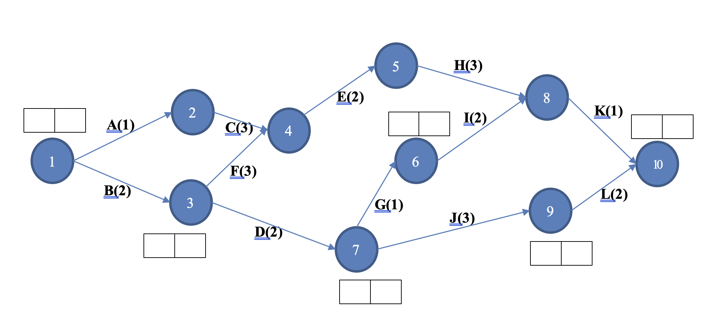

# CS3343 Test One

## I.	Critical Path Analysis (20%)

### Question 1

Question 1.	Show the earliest event time and latest event time for each activity, and clearly indicate Critical Path on the diagram or in a correct sequence (e.g., A -> B -> C -> ...)

<u>Critical Path Analysis of Computer Project</u>
|  | Activity | Immediately Preceding Activities | Duration |
| -- | -- | -- | -- |
| A | High Level Analysis |  | 1 |
| B | Select Hardware |  | 2 |
| C | Core Module Analysis |  | 3 |
| D | Install and Commission Hardware |  | 2 |
| E | Core Module Programming |  | 2 |
| F | Supporting Module Analysis |  | 3 |
| G | Supporting Models Programming |  | 1 |
| H | Dev and QA Management Reports |  | 3 |
| I | QA of Supporting Modules |  | 2 |
| J | Dev MIS |  | 3 |
| K | Core Module Training |  | 1 |
| L | Detailed Training |  | 2 |

(a) EET and LET: Please place your solution directly on the boxes provided on the bubbles. 

(b) For Critical Path:

Option 1: You can directly illustrate by highlighting the lines on the diagram below.

Option 2: You can write the critical path sequence as A -> B -> C -> ... for example. 

## II.	Read your downloaded code listing, and complete all of the following questions: (80%)

Two folders are in the downloaded code list: **ticketSales** and **testTicketSales**. In the folder **ticketSales**, there are classes: **Buyer**, **Category**, and **Ticket**. In the folder **testTicketSales**, there is only one test case file TicketSales.java. The class Ticket will calculate the discount rate of a specified item via the function **getDiscountRate(Category, int)**. Read the code and write your test cases in the file **TicketSales.java** according to the following questions.

**_Attention:_** Don’t paste the screenshot for Q2−Q5. Place in the editable code listing in the box provided.

### Question 2 
Write **six (6)** unit test cases for **Ticket.getDiscountRate(Category, int)** such that each test case goes through a unique path without executing the statements labeled as **L1, L2** and **T1**. (24%)

Copy and paste the test scripts for Question 2 in the following box: 

### Question 3

Write **two (2)** unit test cases for **Ticket.getDiscountRate(Category, int)** such that each test case goes through a unique path with executing the statement labeled as **T1**, and yet the test case invokes your test stub of the **Buyer.isBirthdayThisWeek()**.  (20%)
- Note that you need to write your own test stub for these two test cases. 
Hint: Use either the default constructor or declare a constructor in the stub class with super(…).

### Question 4
Write **two (2)** unit test cases for **Ticket.getDiscountRate(Category, int)** such that each test case goes through a unique path with executing the statement labeled as **T1**, and yet the test case invokes **Buyer.isBirthdayThisWeek()**. (8%)
- Note that <u>do not use your test stub</u> for these two test cases.

### Question 5
In function **Ticket.getDiscountRate(Category, int)**, perform code refactoring using the “Extract Method” so that the related code fragments containing code in reference to Category are to be moved to Category.java, and create a new static function getCategoryRate(Category, int) under Category. 

Use the **“Extract Method”** code refactoring strategy to accomplish this task. (20%)
- This question involves changes in Classes: **Category.java** and **Ticket.java**
- Please copy/paste your entire class codes of **Category.java** and **Ticket.java** to the solution box.

Copy and paste the **refactored code scripts** for **Question 5** in the following box:

### Question 6
Capture the fully expanded **statement coverage screen** generated from your test cases after refactoring completed in Q5. The screenshot should clearly show the coverage measures of the classes: **Buyer**, **Category** and **Ticket**. (8%)

Copy and paste the **screenshot** of statement coverage (**AFTER Refactoring**) in the following box: