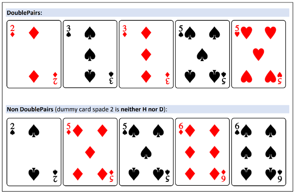
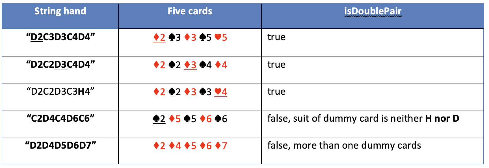
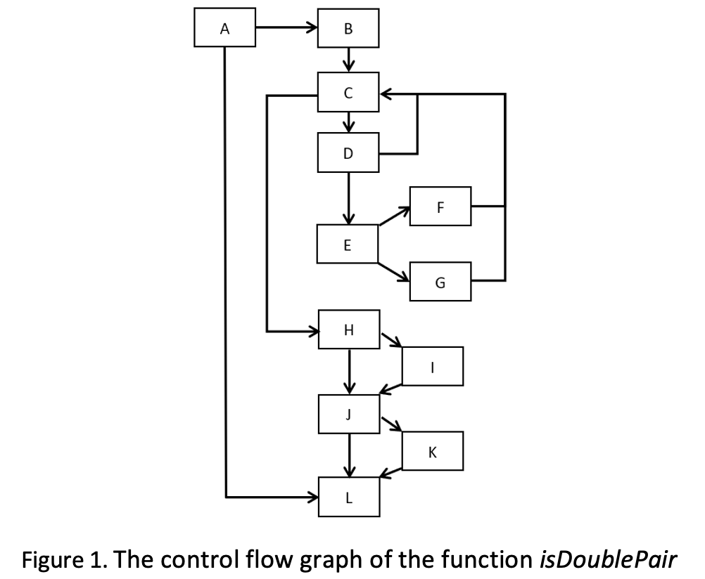
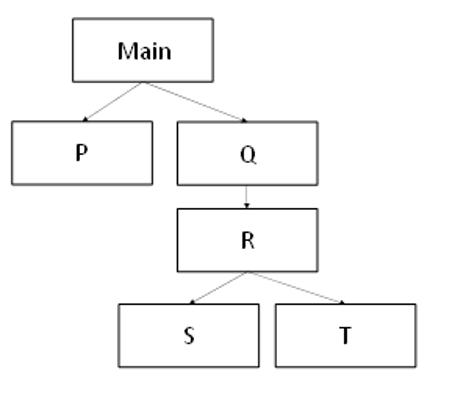

# CS3343 Test Two

## Question 1.	Test Comprehensiveness (36 Marks)

There are two folders are in the downloaded zip file: poker and testPoker. In poker at file **Poker.java**, there is a class Poker which has three functions. In testPoker, there is only one test case file **PokerTest.java**. 

In a poker game, there are totally 13 ranks as 2, 3, 4, 5, 6, 7, 8, 9, X (i.e. 10), J, Q, K, and A. Each rank consists of 4 suits (i.e. C♣, H♥, S♠, and D♦). Each card is <u>a pair of characters</u> consisting of its suit and its rank, respectively. A hand is a sequence of five cards represented by a string with ten characters. **<u>The hand sequence is assumed to be already sorted by rank in ascending order</u>**.

We define a new poker hand combination called DoublePair. DoublePair with five cards consists of exact **<u>two</u>** pairs of same-rank cards in total. The remaining one card is called dummy card. DoublePair restrict that the suit of the dummy card must be containing either **<u>H or D</u>**. For example, as shown in the Table below, “ **<u>D2</u>** C3D3C4D4”, “D2C2 **<u>D3</u>** C4D4”, and “D2C2D3C3 **<u>D4</u>** ” are in DoublePair. “**<u>C2</u>** D4C4D6C6”, “D2D4D5D6D7” are not in DoublePair.

In poker, the function *isDoublePair* checks whether a string hand is in DoublePair by screening from the first to the last card. *isPairMatched* checks whether the last two consecutive cards are in pair or not. *isValidDummy* checks in final that if the current detected dummy card is in suit H / D or not.

You are required to comprehensively test **only** the function *isDoublePair*. It is noted that we do not test or create test stubs for other functions. The control flow graph of *isDoublePair* is given in Figure 1 to help you understand the structure of the code. Each first statement in the corresponding block is labelled in the source code (e.g., return *isDoublePair*; belongs to block L in the control flow graph).

Note: DO **NOT** use any tools to help you generate the branch coverage statistics since their data may be inaccurate due to different definitions with our question on block, branch etc.

(a)	Write **three (x3)** test cases to achieve the maximal branch coverage for function **_boolean isDoublePair (String hand)_**. Fill in Table 1 below. (18 Marks)
- The 2nd column is for the *<u>input values</u>* of the function input variable **String hand**, such as **“D2D3D4D5D6”**, with quotes **“”**.
- The 3rd column is for the *<u>expected output</u>* of your test cases, which should be either true of false. 
- The 4th column is the *<u>covered branches</u>* of your test cases, according to the control flow graph (Figure 1), and is represented by its starting block and ending block, e.g., **AB, BC, ...**

<table>
<tr>
    <th>Test case</th>
    <th>Test input for isDoublePair(String hand) e.g. “D2D3D4D5D6”</th>
    <th>Expected return output as Boolean</th>
    <th>Covered branches e.g., AB, BC, ...</th>
</tr>
<tr>
    <td>1</td>
    <td></td>
    <td></td>
    <td></td>
</tr>
<tr>
    <td>2</td>
    <td></td>
    <td></td>
    <td></td>
</tr>
<tr>
    <td>3</td>
    <td></td>
    <td></td>
    <td></td>
</tr>
</table>

Based on your test input values, convert to JUnit Test cases and copy/paste your JUnit test cases in the following box:

(b) You are required to achieve minimum loop coverage for the **while loop** starting from block C (Line 21) of the control flow graph. Please write three (x3) test cases to test the while loop. (18 Marks)
In Table 2:
- The 2nd column is for the *<u>number of loop iteration</u>* for the three test cases.
- The 3rd column is for the *<u>input values</u>* of the function *isDoublePair* input variable String hand, such as for example **“D2D3D4D5D6”**, with quotes **“”**. 
- The 4th column is for the *<u>expected output</u>* of each test cases: **true** or **false**.

<table>
<tr>
    <th>Test case</th>
    <th>Number of iteration</th>
    <th>Test input for isDoublePair (String hand)</th>
    <th>Expected return output as Boolean</th>
</tr>
<tr>
    <td>1</td>
    <td></td>
    <td></td>
    <td></td>
</tr>
<tr>
    <td>2</td>
    <td></td>
    <td></td>
    <td></td>
</tr>
<tr>
    <td>3</td>
    <td></td>
    <td></td>
    <td></td>
</tr>
</table>

Based on your test input values, convert to JUnit Test cases and copy/paste your JUnit test cases in the following box:

## Question 2.	Test Organization (24 Marks)

#### Observe the above program structure, based on the structure, answer the following questions: 
(a)	To perform unit test on the component S, do you need to create test stubs? Explain your answer. (4 Marks)
(b)	Provide the test sequence when using: **Big Bang** Approach (5 Marks): 
(c)	Provide the test sequence when using: **Bottom-Up** Approach (5 Marks):
(d)	Provide the test sequence when using: **Top-Down** Approach (5 Marks): 
(e)	Provide the test sequence when using: **Modified Top-Down** Approach (5 Marks):

Hints:
- You may need to conduct multiple rounds of integration testing to answer Q2(b), (c), (d), and (e)
- You should write your answers in the following format.
  - **Unit Testing:**
    - Unit Testing 1: X (Test stub: N/A)
    - Unit Testing 2: Y (Test stub: N/A)
  - **Integration Testing:**
    - Integration Testing 1: U+V+Y (Test stub: X)
  - **System Testing:** : Main + U + V + X + Y (Test stub: N/A)
