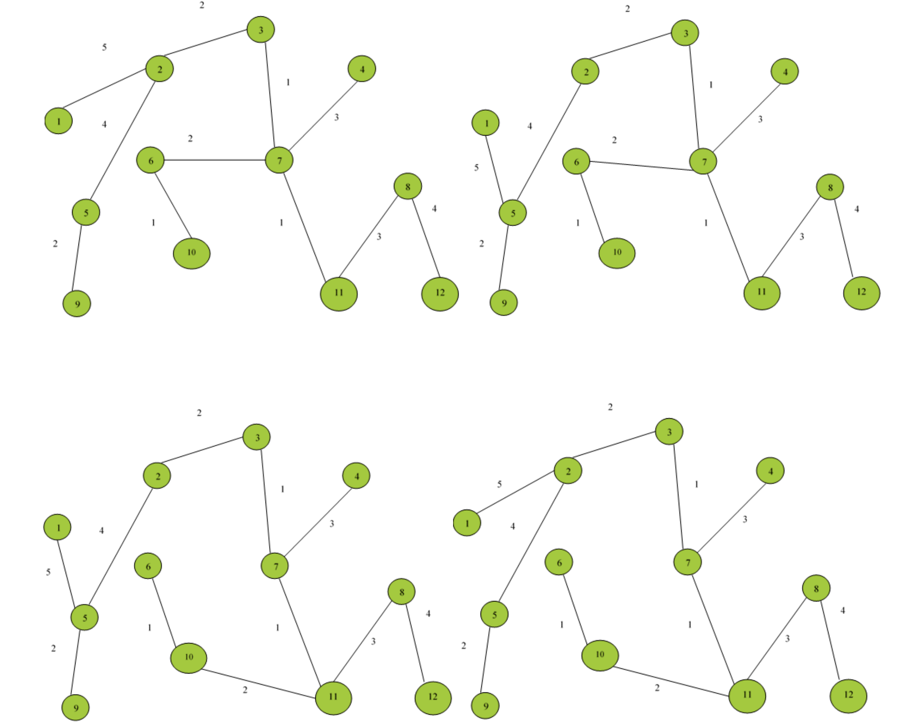

# CS4335 Assignment 1

## Question 1 (40 points)
For the interval scheduling problem, hiven jobs (s,f): (0, 4), (5, 7), (4, 7), (6, 7), (4, 6), (6, 8), (9, 12), find a maximum subset of mutually compatible jobs.

## Question 2 (45 points)
Consider the following graph:


Use Prim’s algorithm to compute a minimum spanning tree (40 marks).

How many minimum spanning trees are in the above graphs, draw all of them (No need to write the process for finding the trees) (5 marks)

## Question 3 (15 points) Words in a tree.
Given a tree of n nodes, each node in the tree has a depth. The root has depth 0. Now consider n words, each word i has a count fi. We want to store the words into the tree, one word per node such that the total distance will be minimized. The total distance of a storage is calculated as
```math
f_1d_1 + f_2d_2 + ... + f_nd_n
``` 
where $ d_i $ is the node depth for word $ i $
Design an algorithm to solve the problem (5 points). Prove that your algorithm is correct. (10 points)

E.g. Given a tree with six nodes (figure 1) and we want store 6 words, **I am a primary school student**, with counts shown as below,

I: 30, am: 26, a: 22, primary: 16, school: 13, student: 6


## Answer

### Question 1
1. sort the jobs by finished time:
(0, 4), (2, 5), (4, 6), (5, 7), (4, 7), (6, 7), (6, 8) (9, 12)

2. the maximum answer is:
(0,4) (4,6) (6,7) (9,12)

### Question 2
Start from 1
The tree is empty. Q contains:

| Node | 1 | 2 | 3 | 4 | 5 | 6 | 7 | 8 | 9 | 10 | 11 | 12 |
| -- | -- | -- | -- | -- | -- | -- | -- | -- | -- | -- | -- | -- |
| Key | 0 | inf | inf | inf | inf | inf | inf | inf | inf | inf | inf | inf |
| Parent | NIL | NIL | NIL | NIL | NIL | NIL | NIL | NIL | NIL | NIL | NIL | NIL |

The tree has one node 1. Q contains:

| Node  | 2 | 3 | 4 | 5 | 6 | 7 | 8 | 9 | 10 | 11 | 12 |
| -- | -- | -- | -- | -- | -- | -- | -- | -- | -- | -- | -- |
| Key | 5 | inf | inf | 5 | inf | inf | inf | inf | inf | inf | inf | inf |
| Parent | 1 | NIL | NIL | 1 | NIL | NIL | NIL | NIL | NIL | NIL | NIL | NIL |

Step 1: select edge(1,2)
Tree has 1, 2. Q contains:
| Node | 3 | 4 | 5 | 6 | 7 | 8 | 9 | 10 | 11 | 12 |
| -- | -- | -- | -- | -- | -- | -- | -- | -- | -- | -- |
| Key  | 2 | inf | 4 | inf | 7 | inf | inf | inf | inf | inf | inf |
| Parent | 2 | NIL | 2 | NIL | 2 | NIL | NIL | NIL | NIL | NIL | NIL |

Step 2: select edge(2,3)
Tree has 1,2,3. Q contains:
| Node | 4 | 5 | 6 | 7 | 8 | 9 | 10 | 11 | 12 |
| -- | -- | -- | -- | -- | -- | -- | -- | -- | -- | -- |
| Key  | 4 | 4 | inf | 1 | inf | inf | inf | inf | inf | inf |
| Parent | 3 | 2 | NIL | 3 | NIL | NIL | NIL | NIL | NIL | NIL |

Step 3: select edge(3,7)
Tree has 1,2,3,7. Q contains:
| Node | 4 | 5 | 6  | 8 | 9 | 10 | 11 | 12 |
| -- | -- | -- | -- | -- | -- | -- | -- | -- | -- | -- |
| Key  | 3 | 4 | 2 | 8 | inf | 9 | 1 | inf | inf |
| Parent | 7 | 2 | 7 | 7 | NIL | 7 | 7 | NIL | NIL |

Step 4: select edge(7,11)
Tree has 1,2,3,7,11. Q contains:
| Node | 4 | 5 | 6 | 8 | 9 | 10 | 12 |
| -- | -- | -- | -- | -- | -- | -- | -- |
| Key  | 3 | 4 | 2 | 3 | inf | 2 | 8 |
| Parent | 7 | 2 | 7 | 11 | NIL | 11 | 11 |

Step 5: select edge(7,6)
Tree has 1,2,3,7,11,6. Q contains:
| Node | 4 | 5 | 6 | 8 | 9 | 10 | 12 |
| -- | -- | -- | -- | -- | -- | -- | -- |
| Key  | 3 | 4 | 2 | 3 | inf | 1 | 8 |
| Parent | 7 | 2 | 7 | 11 | NIL | 6 | 11 |

Step 6: select edge(6, 10)
Tree has nodes 1,2,3,7,11,6,10. Q contains:
| Node | 4 | 5 | 8 | 9 | 12 |
| -- | -- | -- | -- | -- | -- |
| Key  | 3 | 4 | 3 | 5  | 8 |
| Parent | 7 | 2 | 11 | 10 | 11 |

Step 7: select edge(7,4)
tree has 1,2,3,7,11,6,10,4. Q contains:
| Node  | 5 | 8 | 9 | 12 |
| --  | -- | -- | -- | -- |
| Key | 4 | 3 | 5  | 8 |
| Parent | 2 | 11 | 10 | 11 |

Step 8: select edge(11,8)
tree has 1,2,3,7,11,6,10,4,8. Q contains:
| Node  | 5 | 9 | 12 |
| --  | -- | -- | -- |
| Key | 4 | 5  | 4 |
| Parent | 2 | 10 | 8 |

Step 9: select edge(2,5)
tree has 1,2,3,7,11,6,10,4,8,5. Q contains:
| Node | 9 | 12 |
| -- | -- | -- |
| Key | 2  | 4 |
| Parent | 5 | 8 |

Step 10: select edge(5,9)
tree has 1,2,3,7,11,6,10,4,8,5,9. Q contains:
| Node | 12 |
| -- | -- |
| Key | 4 |
| Parent | 8 |

Step 11: select edge(8, 12)

The tree has nodes 1, 2, 3, 7, 11, 6, 10, 4, 8,5, 9, 12. Q contains no nodes.

Edge (1, 2) can be replaced by (1, 5), edge (2, 5) can be replaced by (5, 6), and edge (6, 7) can be replaced by (10, 11) in the final minimum spanning tree. There are 8 minimum spanning trees in the given graphs.




### Question 3
Sort the words with descending order of count, Iterate the given tree with BFS and fill the node with ordered words one by one.

Proof:
Words count with descending order: $ c_0  c_1 ... c_n $ , for each $ 0 <= i < n, c_i <= c_{i+1} $

Distance as the algorithm describes,
$ D_{opt} = c_0d_0 + c_1d_1 + ... + c_nd_n $ , where $ d_i $ is the depth of $i$ th node in the tree, $ d_0 = 0 $ for the root node.

If wee change the insertion order to any two words, $i$ and $ i + 1$ , the distance is,
```math
D_1 = c_0d_0 ... + c_{i+1}d_i + c_id_{i+1} + ... + c_nd_n
```

We can get,
```math
D_{opt} - D_1 = (c_0d_0 + c_1d_1 + ... c_nd_n) - (c_0d_0 ... + c_{i+1}d_i + c_id_{i+1} + ... + c_nd_n) <=0
```
For other insertion situations, we can know $ D_{opt} - D_{other} <= 0 $ always holds