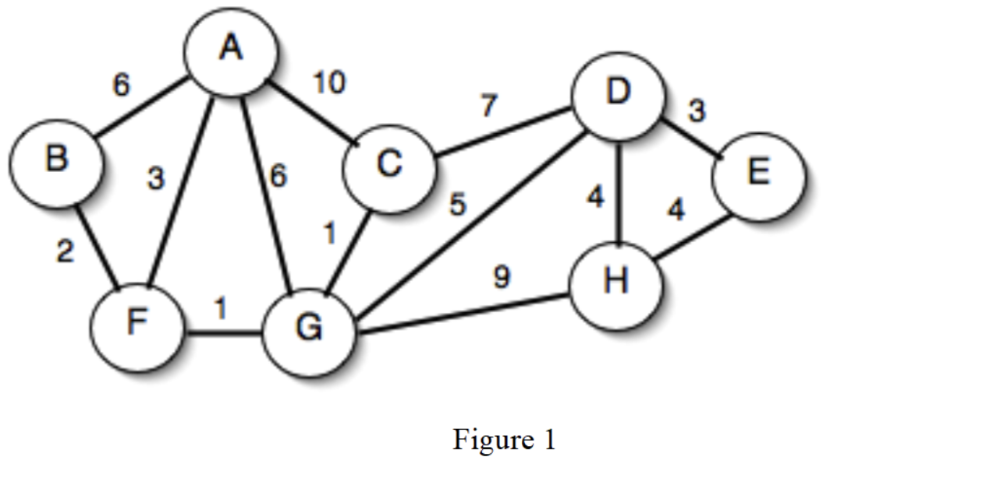
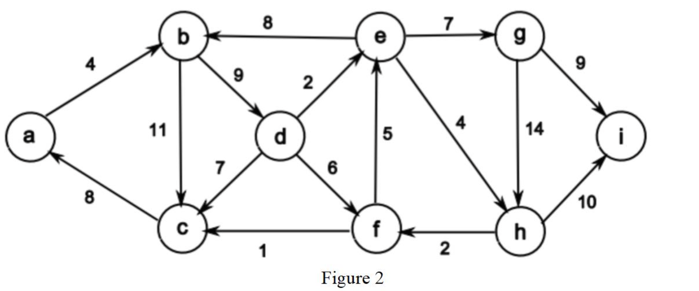
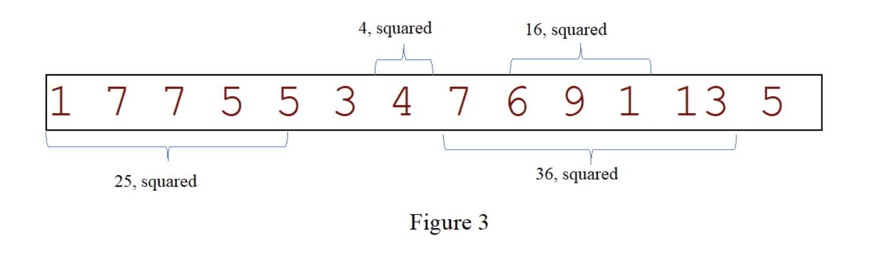

# CS4335 midterm

## Questin 1 (20 points)
(a) (10 points) For the interval scheduling problem, the set of jobs (si, fi) are as follows:

(0, 2), (1, 5), (2, 6), (3, 4), (5, 7) (8, 12), (7, 10), and (9, 13).

Use a greedy algorithm to compute the maximum number of compatible jobs. You should give main steps. What is the running time of the greedy algorithm?

(b) (8 points) For the interval partitioning problem, the set of lectures (si, fi) are as follows:

(0, 2), (0, 4), (2,5), (3, 6), (3, 5), (4, 7), (5, 8) and (6, 9).

Use a greedy algorithm to compute the minimum number of classrooms to accommodate all the lectures. You should give main steps.

(c) (2 points) For the interval partitioning problem given in (b), what is the depth of the problem?

## Question 2 (20 points)
(a) (7 points) Find the minimum spanning tree for the graph in Figure 1 using Kruskal’s algorithm.


(b) (8 points) Find the minimum spanning tree for the graph in Figure 1 using Prim’s algorithm.

(c) (5 points) Is the path between a pair of vertices in a minimum spanning tree of an undirected graph necessarily a shortest path? Justify your answer.

## Question 3 (20 points)
Use Dijkstra’s algorithm to compute a shortest path from a to i in the following graph. You should give main steps.


## Question 4 (15 points)
(a) (9 points) For the list: 2, 1, 5, 8, 9, 10, 4, 7, 6, 13, 14, and 11. Suppose we have sorted the two halves as list1: 1, 2, 5, 8, 9, 10; and list2: 4, 6, 7, 11, 13, 14. Calculate the number of inversions with one number in list1 and the other number in list2 using O(n) operations. Immediate steps are required.

(b) (3 points). Assume T(n) is the running time for the following algorithm. List the recursive relation, and with it, what is T(n) in terms of big O notation?

```
FindMax(A, k, n)

    Input: Array A of size n, and an integer k<n
    Output: the maximum element from A[k], A[k+1], …, A[n-1]
        if k<n-1
            return max(A[k], FindMax(A, k+1, n))
        else return A[k]

Initial call FindMax(A, 0, n)
```

(c) (1 point) Suppose T(1)=1, and T(n)=T(n-1)+n. What is T(n) in terms of big O notation?

(d) (2 points) Suppose T(1)=1, and T(n)=T(n/3)+1. What is T(n) in terms of big O notation?

## Question 5 (15 points)

Given an array of n ≥ 2 distinct integers (i.e., no two integers are the same) sorted in ascending order, say [x(1),...,x(n)], we want to find the absolute minimum difference between the x(i) and i. For example, for x = [-10, 9, 10, 12, 13, 16] , the minimum difference $ d = | x(2) - 2 | = | 9 - 2 | = 7 $

(a) (5 points) Use a linear time algorithm to solve the problem.

(b) (5 points) Use a divide and conquer approach the solve the problem. The running time should be O(logn).

(c) (5 points) Set up and solve a recurrence equation for part (b) to estimate the running time of your algorithm. Prove that the running time of your algorithm is O(logn).

Hint: The difference will first decrease and then increase.

## Question 6 (15 points)

Suppose we have an array of n positive integers. A contiguous subarray A[i .. j] is called a squared interval if the sum of its entries is a squared number. Design a greedy algorithm to compute the maximum number of squared intervals such that every entry in A will be covered at most once. You can state your algorithm in English or in Pseudo code **(5 points)**. What is the running time of algorithm in big-Oh **(5 points)**? Prove that your algorithm is correct (5 points).




## Answer
### Q1
(a) Sorting based on finish time: (0, 2), (3, 4), (1, 5), (2, 6), (5, 7), (7, 10), (8, 12) (9,13)


```
{(0, 2)}
{(0, 2), (3, 4)}                        (1, 5) (2, 6) overlap
{(0, 2), (3, 4), (5, 7)}
{(0, 2), (3, 4), (5, 7), (7, 10)}       (8, 12) (9, 13) overlap

Max = 4 jobs
Running time: O(nlogn)
```

(b) Sort based on start time: (0, 2), (0, 4), (2, 5), (3, 5), (3, 6), (4, 7), (5, 8), (6, 9)

```
Room 1: (0, 2), (2, 5), (5, 8)
Room 2: (0, 4), (4, 7)
Room 3: (3, 5), (6, 9)
Room 4: (3, 6)
```

(c) Depth = 4

### Q2
First, we sort the edges in ascending order of their weights:
```math
CG_1, FG_1, BF_2, AF_3, DE_3, DH_4,EH_4, DG_5, AB_6, AG_6, CD_7, GH_9, AC_10
```
Then, we select edges of which the two vertices are in different trees:
```math
CG_1, FG_1, BF_2, AF_3, DE_3, DH_4, DG_5
```

### Q3
Start from A.

<table>
		<thead>
			<tr>
				<th></th>
				<th>A</th>
				<th>B</th>
				<th>C</th>
				<th>D</th>
				<th>E</th>
				<th>F</th>
				<th>G</th>
				<th>H</th>
			</tr>
		</thead>
		<tbody>
			<tr>
				<td>Start</td>
				<td>0/NIL</td>
				<td>INF/NIL</td>
				<td>INF/NIL</td>
				<td>INF/NIL</td>
				<td>INF/NIL</td>
				<td>INF/NIL</td>
				<td>INF/NIL</td>
				<td>INF/NIL</td>
			</tr>
			<tr>
				<td>Pick A</td>
				<td></td>
				<td>6/A</td>
				<td>10/A</td>
				<td>INF/NIL</td>
				<td>INF/NIL</td>
				<td>3/A</td>
				<td>6/A</td>
				<td>INF/NIL</td>
			</tr>
			<tr>
				<td>PickF</td>
				<td></td>
				<td>2/F</td>
				<td>10/A</td>
				<td>INF/NIL</td>
				<td>INF/NIL</td>
				<td></td>
				<td>1/F</td>
				<td>INF/NIL</td>
			</tr>
			<tr>
				<td>PickG</td>
				<td></td>
				<td>2/F</td>
				<td>1/G</td>
				<td>5/G</td>
				<td>INF/NIL</td>
				<td></td>
				<td></td>
				<td>9/G</td>
			</tr>
			<tr>
				<td>PickC</td>
				<td></td>
				<td>2/F</td>
				<td></td>
				<td>5/G</td>
				<td>INF/NIL</td>
				<td></td>
				<td></td>
				<td>9/G</td>
			</tr>
			<tr>
				<td>PickB</td>
				<td></td>
				<td></td>
				<td></td>
				<td>5/G</td>
				<td>INF/NIL</td>
				<td></td>
				<td></td>
				<td>9/G</td>
			</tr>
			<tr>
				<td>PickD</td>
				<td></td>
				<td></td>
				<td></td>
				<td></td>
				<td>3/D</td>
				<td></td>
				<td></td>
				<td>4/D</td>
			</tr>
			<tr>
				<td>PickE</td>
				<td></td>
				<td></td>
				<td></td>
				<td></td>
				<td></td>
				<td></td>
				<td></td>
				<td>4/D</td>
			</tr>
			<tr>
				<td>PickH</td>
				<td></td>
				<td></td>
				<td></td>
				<td></td>
				<td></td>
				<td></td>
				<td></td>
				<td></td>
			</tr>
		</tbody>
	</table>

Edgeset={BF, CG, DG, ED, FA, GF, HD }

(c) No, a path between a pair of vertices in a minimum spanning tree is not necessarily their shortest path. For example, the shortest path between H and E should be H->E, of which the distance is 4. However, in an MST, E can only be reached via D from H, of which the total distance is 7, and is longer than the shortest path.

### Q3

<table>
		<thead>
			<tr>
				<th>iteration</th>
				<th>a</th>
				<th>b</th>
				<th>c</th>
				<th>d</th>
				<th>e</th>
				<th>f</th>
				<th>g</th>
				<th>h</th>
				<th>i</th>
			</tr>
        </thead>
        <tbody>
			<tr>
				<td>0</td>
				<td>0/nil</td>
				<td>∞/nil</td>
				<td>∞/nil</td>
				<td>∞/nil</td>
				<td>∞/nil</td>
				<td>∞/nil</td>
				<td>∞/nil</td>
				<td>∞/nil</td>
				<td>∞/nil</td>
			</tr>
			<tr>
				<td>1</td>
				<td></td>
				<td>4/a</td>
				<td>∞/nil</td>
				<td>∞/nil</td>
				<td>∞/nil</td>
				<td>∞/nil</td>
				<td>∞/nil</td>
				<td>∞/nil</td>
				<td>∞/nil</td>
			</tr>
			<tr>
				<td>2</td>
				<td></td>
				<td></td>
				<td>15/b</td>
				<td>13/b</td>
				<td>∞/nil</td>
				<td>∞/nil</td>
				<td>∞/nil</td>
				<td>∞/nil</td>
				<td>∞/nil</td>
			</tr>
			<tr>
				<td>3</td>
				<td></td>
				<td></td>
				<td>15/b</td>
				<td></td>
				<td>15/d</td>
				<td>19/d</td>
				<td>∞/nil</td>
				<td>∞/nil</td>
				<td>∞/nil</td>
			</tr>
			<tr>
				<td>4</td>
				<td></td>
				<td></td>
				<td>15/b</td>
				<td></td>
				<td></td>
				<td>19/d</td>
				<td>22/e</td>
				<td>19/e</td>
				<td>∞/nil</td>
			</tr>
			<tr>
				<td>5</td>
				<td></td>
				<td></td>
				<td></td>
				<td></td>
				<td></td>
				<td>19/d</td>
				<td>22/e</td>
				<td>19/e</td>
				<td>∞/nil</td>
			</tr>
			<tr>
				<td>6</td>
				<td></td>
				<td></td>
				<td></td>
				<td></td>
				<td></td>
				<td>19/d</td>
				<td>22/e</td>
				<td></td>
				<td>29/h</td>
			</tr>
			<tr>
				<td></td>
				<td></td>
				<td></td>
				<td></td>
				<td></td>
				<td></td>
				<td></td>
				<td>22/e</td>
				<td></td>
				<td>29/h</td>
			</tr>
			<tr>
				<td></td>
				<td></td>
				<td></td>
				<td></td>
				<td></td>
				<td></td>
				<td></td>
				<td></td>
				<td></td>
				<td>29/h</td>
			</tr>
		</tbody>
	</table>

The shortest path is: a-b-d-e-h-i

The shortest length is: 29

### Q4
(a)
```
4 : 4
6 : 3
7 : 3
11 : 0
13 : 0
14 : 0

Sum of inversions : 10
```

(b) The recurrence expression for T(n) is : T(n)=T(n−1)+1. Hence, T(n)~𝑂(𝑛).


(c)  $ T(n) = (T(1) + (n+2)(n-1))/2 $ , hence $ T(n) $ ~ $ 𝑂(𝑛^2) $ .


(d) $ T(n) = T(n/3^k) + k $. Assume, $ n/(3^k) $, we have $ k= \log_{3}(n) $.

In this way, $ T(n) = 1 + \log_{3}n = 1 + \log n / log_{2}3 $ . Hence, $ T(n) $ ~ $ O(log n)$ .

### Q5
(a) 
```
min = ∞
for i=1 to n:
    if x[i]-i < min:
        min = |x[i]-i|
return min
```

(b)
```
minDiff(l, r)
    if r-l=0 or r-1=1
        return min(|x[l]-l|, |x[r]-r|)
    mid=⌊(l+r)/2⌋
    if x[mid]>mid:
        return minDiff(l, mid)
    else 
        return minDiff(mid, r)

call minDiff(1, n)
```

(c)
$ T(n) = T(n/2) + 1 $

$ T(n/2) = T(n/2^2)+1 $

...

$ T(n/2^{k-1}) = T(n/2^{k})+1 $

Then, $ T(n) = T(n/2^{k}) + k $
Assume $ n/2^k = 1 $ , and we have $ k = log_{2}n $

$ T(n)=1+ log_{2}n $ , and $ T(n) = O(log_{n}) $

### Q6
(a)
```
For i=1 to n. 
    Find the shortest squared interval ending at i.  If no such interval, return nil. 
     // For each i,  the running time is at most O(n), thus, the total running time for Phase 1 is O(n^2) .  There are at most n intervals found by Phase 1.  You should give the details of how to find the shortest squared interval.  
 
    Let the squared intervals obtained by phase 1 as inputs and use the interval scheduling algorithm to find the maximal number of the compatible intervals.  
    // the running time of Phase 2 is O (n), since the intervals from Phase 1 are sorted according to finish time, and no sorting is necessary.  
```

(b) $ O(n^2) $

(c) (1) Let A be a maximal set of non-overlapped squared interval. If A contains an interval starting at i,  replace this interval by the shortest squared interval starting at i will not  change the optimality of A. (2) For each i,  A can contain at most one interval starting at i. 
(1)+(2) indicate that this problem is equivalent to the interval scheduling problem and the algorithm is correct. 
