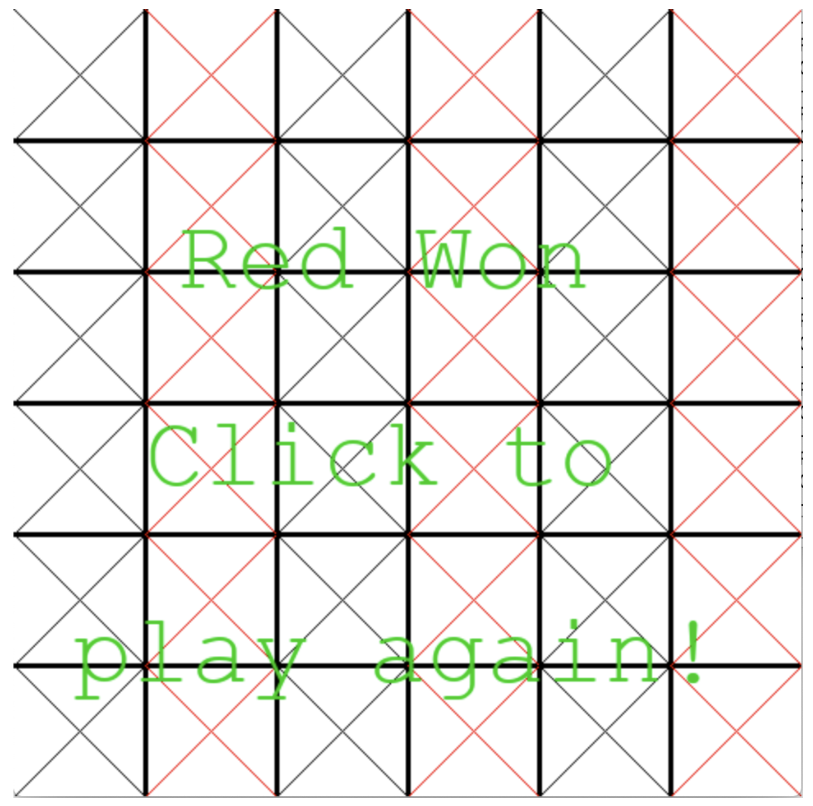
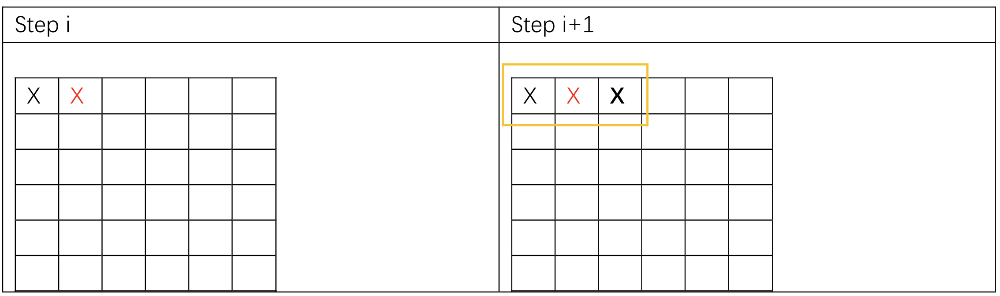
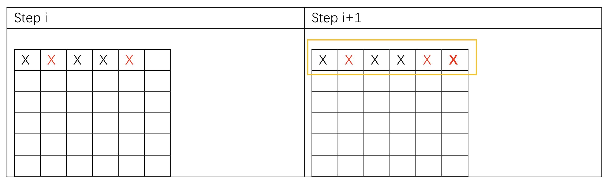
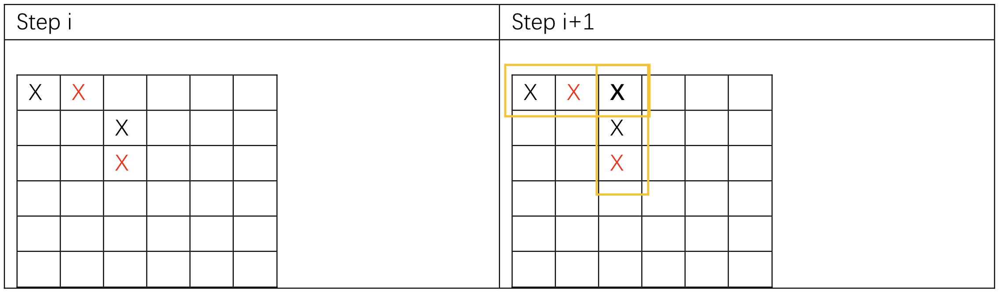

# CS4386 Assignment 1
> Suggest you implement algorithm learned in course. For example: alpha beta pruning minimax, etc to get max/higher mark

## Game Description
Therearetwo players in this game. In each turn, a player can put an "X" in the empty cell of the 6*6 board. Any player who can connect 3 or 6 adjacent ‘X’(color doesnot matter)in a row/column(**no diagonal**) will get 3 or 6 pointsrespectively.The game ends when all the cells are taken by players and the player who gets higherpoints is the winner.


Case 1-3 illustrate the rules of this game(Player 1is denoted by blackand Player 2is denoted by red).

### Case 1

In this case, player1 will get 3 points in step i+1 since he connects 3 adjacent "X".

### Case 2

In this case, player2(red) will get 6 points in step i+1 since he connects 6 adjacent ‘X’.

### Case 3

In this case, player 1 will get 3+3=6 points in step i+1 since he connects 3 adjacent ‘X’both in row and column

## Source Code
Original repository: [Github](https://github.com/sheilaya/CS4386_assignment)


## How to Run

It is support 3 languages for implement your AI: C++, JAVA and Python. Python is the easiest oneto implement since our server program is written in Python. Hence we highly recommendyou to use Python. If you are not familiar with Python, you can use Java or C++

### Mode 1: Human VS AI
#### Implemented by C++
```bash
cd cpp
g++ AIPlayer.cpp -fPIC -shared -o aiplayer.so
cd ..
#if you want the Human play first, use
python3 game.py Human CPP 1
#if you want the AI play first, use:
python3 game.py Human CPP 2
```

#### Implemented by Java:
```bash
cd java
javac AIPlayer.java
mkdir com
mv AIPlayer.class com
jar cvf AIPlayer.jar com
cd ..
python3 game.py Human JAVA 1
```

#### Implemented by Python:
```bash
python3 game.py Human PYTHON 1
```

### Mode 2: AI VS AI
```bash
#if you want the JAVA AI play with PYTHON AI
python3 game.py JAVA PYTHON 1
#if you want the PYTHON AI play with PYTHON AI
python3 game.py PYTHONPYTHON 1
```


## Implement your AI algorithm
Take the python version for example, you need to modify the **get_move()** function in AIPlayer.py.
```python
def get_move(self,state, player):
    # implement your algorithm here
    games = self.empty_cells(state)
    random_move=games[0]
    # the end of your algorithm
    return random_move
```

The example returns a random move, and you should modify it using your own algorithm.IfyourAIfailsto return a move in a long time(e.g. 10 secondsper turn), your opponent will win the game.

You can define your own variables and functionsin the AIPlayer Class, but you cannot delete existing variables or functions in AIPlayer Class.Meanwhile, you cannot change the function parameters of get_move() fuction.

Note: When implement your AI, you **MUST not** change game.py or gui.py.

## Scoring Scheme

Total 20 scores = Performance of your AI + codes + report

#### Regarding the Report
1. You should write a report to explain your AI.
2. You should then describe your algorithm as clearly as possible. Feel free to use examples and add screenshots or other figures if it can help better illustrate your me
3. If you adopt some part of your code from somewhere, you must fully acknowledge this and provide a reference to where you obtain the code.You must declare how much of your submitted code is obtained from someone/somewhere else and how much is indeed written by you.
4. At the end of your report, include the related references from where you have gathered useful information in working on your assignment