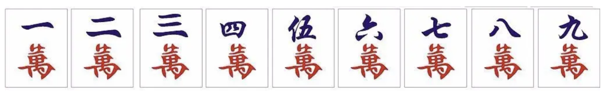

# CS4386 Assignment 2

## Game Description
2-player Mahjongonly with character tiles.



| Tile Name | 1 | 2 | 3 | 4 | 5 | 6 | 7 | 8 | 9 |
| -- | -- | -- | -- | -- | -- | -- | -- | -- | -- |
| #Tiles | 4 | 4 | 4 | 4 | 4 | 4 | 4 | 4 | 4 |
In total, there are 9*4=36 tiles

### Rules
At beginning, the server will randomly give7 tilesto each player.In each player’s turn, there are fivedifferent cases:
1. Choose to Chow(claiming a tile to match a sequence). If youropponent dropsa tile N, and you have
   1.  N+1 and N+2 or
   2.  N-1 and N+1 or 
   3.  N-2 and N-1
you can choose to Chowandthen dropsone tile(you cannot drop the 3 tiles used for Chow).

2. Choose to Pong(claiming a tile to match a triplet).If youropponent drops a tile Nand you have two Ns, you can choose to Pongand then drop one tile(you cannot drop the 3 tiles used for Pong).
3. Normal case. If you choose to not Chow/Pong, you can get(or called draw)a tile from the server and then drops one tile.
4. Hu(claiming a tile to win). After Chow/Pong/get a tile, if you can achieve the win state (win state: the number of pairis 1, the number of sequence+ the number of tripletis 2), you can Hu. 

Here are some examples of win states:

| Win State | Explanation |
| -- | -- |
| <span style='background-color: yellow'>123</span> <span style='background-color: LightGreen'>456</span> <span style='background-color: Aqua'>77</span> | 123 is a sequence, 456 is a sequence, 77 is a pair. |
| <span style='background-color: Aqua'>11</span> <span style='background-color: yellow'>123</span> <span style='background-color: LightGreen'>333</span> | 11 is a pair, 123 is a sequence, 333 is a triple |
| <span style='background-color: LightGreen'>111</span> <span style='background-color: Aqua'>222</span> <span style='background-color: yellow'>33</span> |  111 is a triplet, 222 is a triplet, 33 is a pair |
| <span style='background-color: yellow'>22</span> <span style='background-color: LightGreen'>34</span> <span style='background-color: Aqua'>4</span> <span style='background-color: LightGreen'>5</span> <span style='background-color: Aqua'>56</span> | 22  is  a  pair,  345  is  a  sequence,  456  is sequence |

5. Give card shooting to your opponent. If your opponent can achieve the win state using the tile you just drops, then you give card shooting to your opponent and your opponent winthe game. For example, your opponent has the tiles “<span style='background-color: yellow'>1 1 1</span> <span style='background-color: LightGreen'>2 3 4</span> 5”, andyou drop a “5”, then your opponent wins.

## Source Code
Original repository: [Github](https://github.com/sheilaya/CS4386_assignment2)

## How to Run
To run the demo codes, you need to install python3.6 first.
**(Note: In A1, somestudents have problems installing packages and running the codes. Hence, we will provide a tutorial about how to build the python environment, which will be released on CANVAS later.)**

We support 3 languages for implementingyour AI: C++, JAVA and Python. Python is the easiest oneto implement since our server program is written in Python. Hence we **highly recommend** you to use Python. If you are not familiar with Python, you can use Java or C++

### Mode 1: Human VS AI
#### Implemented by C++
```bash
cd cpp
g++ AIPlayer.cpp -fPIC -shared -o aiplayer.so
cd ..
#if you want the Human play first, use
python3 game.py Human CPP 1
#if you want the AI play first, use:
python3 game.py Human CPP 2
```

#### Implemented by Java:
```bash
cd java
javac AIPlayer.java
mkdir com
mv AIPlayer.class com
jar cvf AIPlayer.jar com
cd ..
python3 game.py Human JAVA 1
```

#### Implemented by Python:
```bash
python3 game.py Human PYTHON 1
```

### Mode 2: AI VS AI
```bash
#if you want the JAVA AI play with PYTHON AI
python3 game.py JAVA PYTHON 1
#if you want the PYTHON AI play with PYTHON AI
python3 game.py PYTHONPYTHON 1
```

## Implement your AI algorithm 
You only need to modify AIPlayer.py (if you use python). Here are **three** functions you need to modify:
```python
def think_pong(self):
    # return true or false
    return True

def think_chow(self):
    # return 1,2,3 or 0
    return 0

def think(self):
    for i in range(0,9):
        if self.player_cnt[i] > 0:
            return i
```

(1) If the opponent drops tile N, then you have two optionsfor think_pong():
| Option | Return value of think_pong()|
| -- | -- |
| You have two tile Ns and you want to Pong | True|
| You don’t want to Pong | False |

(2) If the opponent drops tile N, then you may have several options for think_chow():
| Option | Return value of think_chow()|
| -- | -- |
| You have N+1 and N+2. And you use those 2 tiles to Chow. | 1 |
| You have N-1 and N+1. And you use those 2 tiles to Chow. | 2 |
| You have N-2 and N-1. And you use those 2 tiles to Chow. | 3 |
| You don’t want to Cho | 0 |

(3) If you don’t Chow/Pong, you will get a tile from the server. Then you can use think() to return a tile you want to drop.

Note: The update_state() function will transfer the useful variables to your AI

```python
def update_state(self,gametable_receive_tiles,gametable_receive_cnt,player_cnt,player_cnt_p,player_cnt_c,oppo_cnt_p,oppo_cnt_c):
    self.gametable_receive_tiles=gametable_receive_tiles
    self.gametable_receive_cnt: list=gametable_receive_cnt
    self.player_cnt: list = player_cnt
    self.player_cnt_p = player_cnt_p
    self.player_cnt_c = player_cnt_c
    self.oppo_cnt_p=oppo_cnt_p
    self.oppo_cnt_c=oppo_cnt_c
```

| variable | Example | Explanation |
| -- | -- | -- |
| gametable_receive_tiles :int[][2] | [[1,0],[2,3],...] | It stores the history of dropped tiles.The example means in step 1, player1drops tile1, in step 2, player2 drops tile4 |
| gametable_receive_cnt :int[9] | [1,0,0,1,0 0,0,0,0] | It stores the dropped tiles.The examples means tile1 and tile4 have been dropped by both players |
| player_cnt :int[9] | [1,1,1,1,1,1,1,0,0] | It stores the tiles the player has.The example means the playerhas tile 1-7. |
| player_cnt_p :int[9] | [1,0,0,0,0,0,0,0,0] | It stores the tiles the player has Pong-ed.The example means the player has a triplet:three tile1s. |
| player_cnt_c :int[9] | [0,1,0,0,0,0,0,0,0] | It stores the tiles the player has Chow-ed.The example means the player has a sequence: tile2, tile3, tile4 |
| oppo_cnt_pint[9] | - | It stores the tiles the opponent has Pong-ed. |
| oppo_cnt_cint[9] | - | It storesthetiles the opponent has Chow-ed. |

## Scoring Scheme

Total 15 scores = Performance of your AI + codes + report
1. Performance of your AI:
We will run your AI against your classmate’s AI for N rounds (switch place for each round). And then we will calculate the win rate. The one with higher win rate is the winner. If the win rate is equal, we will then checkthe scoreofeach AI, where the score isthe sumof your tiles when your AIwin the game.

| Win State | Score |
| -- | -- |
| <span style='background-color: yellow'>123</span> <span style='background-color: LightGreen'>456</span> <span style='background-color: Aqua'>77</span> | 1+2+3+4+5+6+7+7=35 |
| <span style='background-color: Aqua'>11</span> <span style='background-color: yellow'>123</span> <span style='background-color: LightGreen'>333</span> | 1+1+1+2+3+3+3+3=17 |

#### Regarding the Report
1. You should write a report to explain your AI.
2. You should then describe your algorithm as clearly as possible. Feel free to use examples and add screenshots or other figures if it can help better illustrate your me
3. If you adopt some part of your code from somewhere, you must fully acknowledge this and provide a reference to where you obtain the code.You must declare how much of your submitted code is obtained from someone/somewhere else and how much is indeed written by you.
4. At the end of your report, include the related references from where you have gathered useful information in working on your assignment